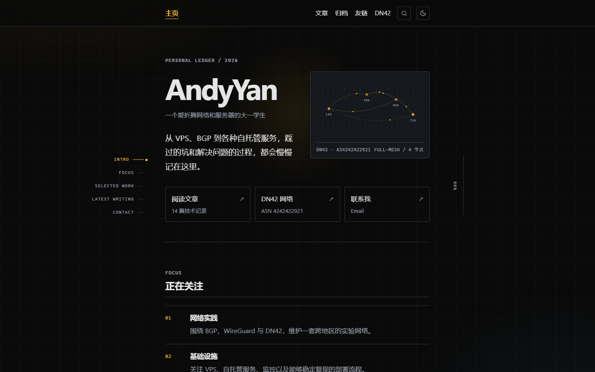
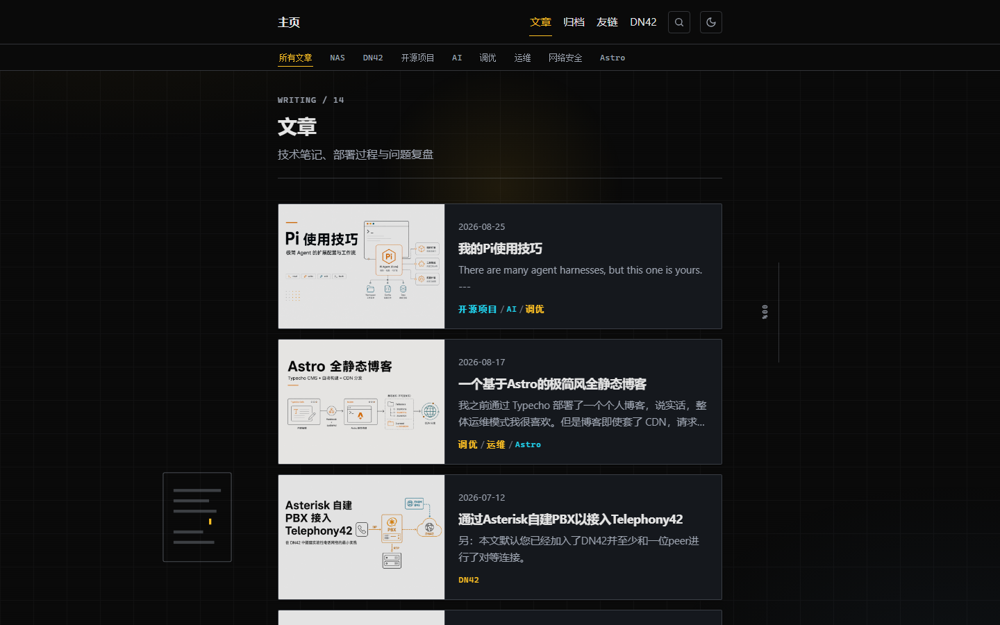
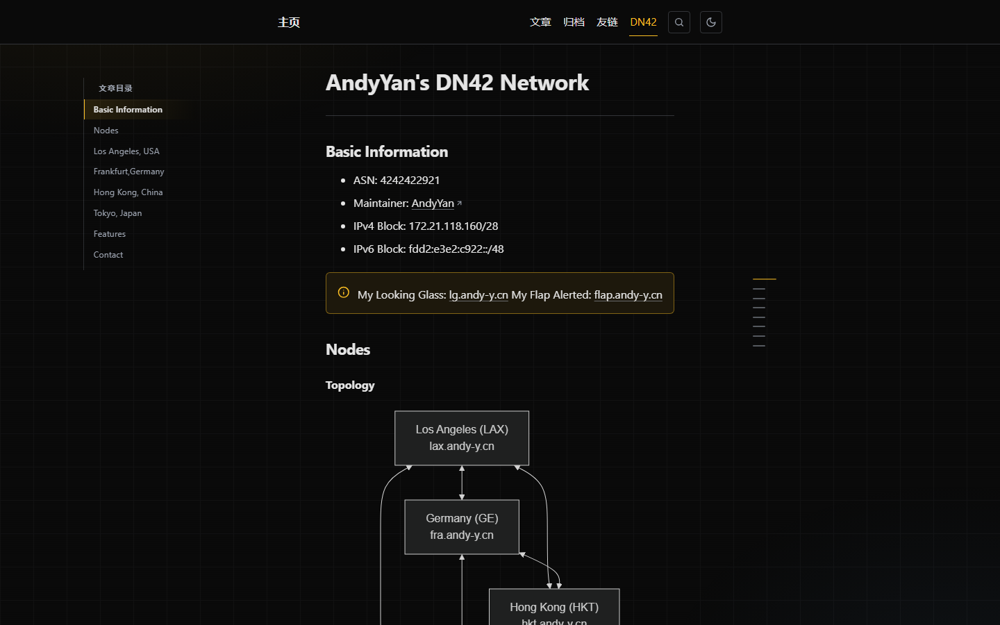
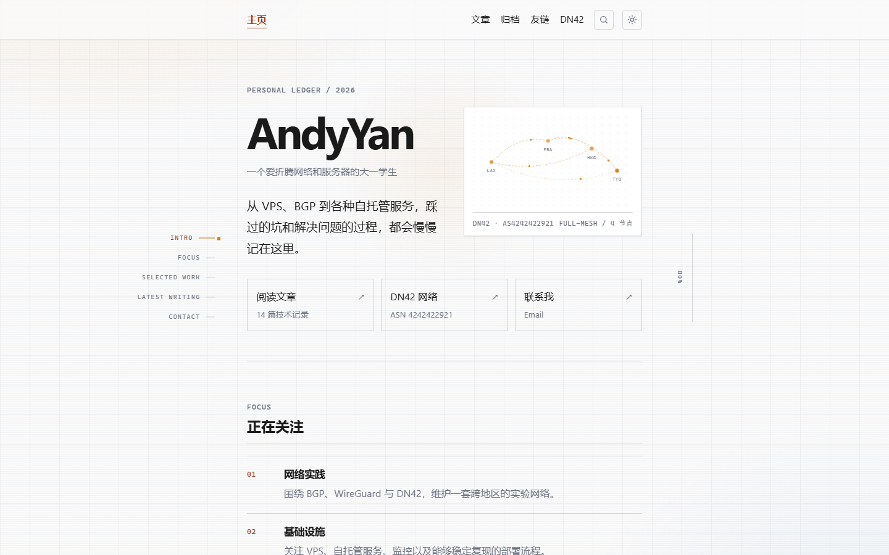

# andy-blog

[www.andy-y.cn](https://www.andy-y.cn) — Typecho 1.2.1 headless CMS → **Astro 7** static site / Typecho 无头 CMS → **Astro 7** 全静态站.

Editors write in Typecho; visitors read Astro. Builds run off-box; publish is blue-green immutable releases. Comments: Waline (proxied via www).  
编辑在 Typecho，访客读 Astro；构建在 off-box，发布走蓝绿不可变 release。评论走 Waline（经 www 反代）。

## Screenshots / 截图

Production captures from [www.andy-y.cn](https://www.andy-y.cn) (desktop). Assets live in [`docs/readme-assets/`](./docs/readme-assets/).

| Home (dark) | Posts (dark) |
|:---:|:---:|
|  |  |

| DN42 + Mermaid (dark) | Home (light) |
|:---:|:---:|
|  |  |

---

## English

Personal tech ledger: VPS, BGP/DN42, self-hosted ops. Content is authored in Typecho, synced into Astro, and served as a fully static frontend with Pagefind search and Waline comments.

### Architecture

```
Typecho admin ──HMAC──► rebuild-api ──► blog-rebuild-1panel.sh
                                            │
              SSH (+ optional jump) ──► off-box builder (Astro + Playwright)
                                            │
              rsync release.tar.gz + checksums ──► VPS releases/
                                            │
                     mv -T atomic switch current ←→ previous (rollback)
                                            │
                     OpenResty www + Aliyun / Cloudflare CDN purge
```

Separate status plane: `build2.fei.cx` → Caddy → loopback off-box status UI (password session, fail-closed).

Off-box SSH is configured only on the VPS (`/etc/andy-blog/offbox-builder.env`, mode `0600`) from [`host/offbox-builder.env.example`](./host/offbox-builder.env.example): target host, optional non-default `OFFBOX_SSH_PORT`, and optional jump/relay when the direct path is slow. Do not commit real hosts, ports used in production, or private keys.

### Layout

| Path | Role |
|------|------|
| `astro/` | Site source (content, components, styles, build) |
| `typecho/` | CMS plugins / config scaffolding (AutoRebuild, AstroPreview) |
| `scripts/` | Sync, gates, nginx generation, comment migration, CDN |
| `host/` | VPS / off-box publish scripts, systemd, status UI |
| `docker/` | rebuild-api, Waline |
| `nginx/` | Generated `release-http.conf` (do not hand-edit; use `generate-nginx.js`) |
| `data/` | Route graph, legacy URL map, lastmod |
| `docs/` | Phase baselines, plans, authorized runbooks; README screenshots in `docs/readme-assets/` |
| `audit/` | 2026-08-26 security / frontend audit reports |

### Local development

Requires **Node ≥ 22.12**. Mermaid build needs Playwright Chromium:

```powershell
npm install
npm --prefix astro install

# Playwright browser path (without this, mermaid may silently drop body content)
$env:PLAYWRIGHT_BROWSERS_PATH = "$env:LOCALAPPDATA\ms-playwright"

# Frontend-only iteration
npm --prefix astro run dev

# Full pipeline: Typecho snapshot → gates → Astro build → Pagefind(zh)
$env:SNAPSHOT_EPOCH = "1785565762"   # or current snapshot epoch
npm run build
npm --prefix astro run preview -- --host 127.0.0.1 --port 4321
```

Useful checks:

```powershell
node --test host/offbox-status-ui/server.test.js
npm run stage10:gate
npm run lighthouse:local    # against astro/dist
```

### Frontend notes

- Markdown / HTML via `rehype-raw` → **`rehype-sanitize`**; `:::cloud` allows only `http(s)` or same-origin paths
- Body `#` headings demoted to `h2` at build time (TOC / reading progress depend on `h2`)
- Mermaid: build-time BEOE dual-theme SVG; visitors can open lightbox
- Listening: `/listening/` curated NetEase Cloud songs via Typecho `{netease id="…" note="…"}` (id required; title/artist/cover optional — filled at build); homepage has a short entry; CSP `frame-src` allows `music.163.com`
- LinuxDo invite: `/linuxdo/` page on the site; PoW challenge/claim API on off-box `build2.fei.cx` (invite URL is not in static HTML)
- Post header: publish date, estimated reading time (400 Chinese characters / minute, at least 1 minute), character count; shows「更新于」when `updatedDate` is a different UTC day
- Search: Pagefind with `--force-language zh`
- Theme: light / dark + View Transitions; `prefers-reduced-motion` globally respected
- Lazy load: KaTeX / Pagefind UI / Waline

### Release & ops

- Trigger: Typecho AutoRebuild (admin + CSRF) → signed request → rebuild-api queue
- Build: VPS exports Typecho snapshot → rsync control tree to off-box → Astro / Playwright build → pull `release.tar.gz` back with rsync (scp progress mirror is best-effort + timed out so it cannot stall publish)
- Off-box speed: keep `astro/.cache/img-dims.json` and `beoe-cache.json` across builds (only wipe `astro/node_modules/.astro`); Mermaid uses a durable Beoe Map cache so unchanged fences skip Playwright; `render-gate` / `rss-gate` / `stage4-gate` run in parallel; phase logs include `PROGRESS_TIMING <phase> <Ns>`
- Switch: full `checksums.sha256` verify → blue-green `current` / `previous`
- Rollback / roll-forward: `host/rollback-release.sh` · `host/roll-forward-release.sh`
- Nginx redirect mode: `npm run nginx:302` / `nginx:301` (regenerate after editing `data/legacy-url-map.json`)

Production credentials stay in host env / secret files — **never** commit them here. Do not commit `secrets/`, `.env`, private keys, or `.planning/` (local ops packets; gitignored).

### Security

2026-08-26 audit: [`audit/2026-08-26/`](./audit/2026-08-26/) (frontend re-review [`audit/2026-08-26-2/`](./audit/2026-08-26-2/)). Landed items include:

- www HSTS / CSP / nosniff / frame deny and related response headers
- status UI fail-closed + login rate limit
- tar path validation, Markdown sanitization, shortcode protocol limits, SSH without hardcoded defaults

Remaining Medium / Low findings and remediations follow the audit reports.

### Rules

- Production SSH / MySQL: read-only by default; writes need separate authorization and a runbook
- Do not commit `secrets/`, `backups/`, `.env`, or private keys
- Local planning packets live under `.planning/` (gitignored)

---

## 中文

个人技术账本：VPS、BGP/DN42、自托管运维。内容在 Typecho 撰写，同步进 Astro，对外全静态站点（Pagefind 搜索 + Waline 评论）。

### 架构

与上方 English 小节中的 ASCII 图相同：Typecho → HMAC 签名 → rebuild-api →（可选跳板）off-box Astro 构建 → rsync 拉回 `release.tar.gz` + checksums → VPS 蓝绿 `current`/`previous` → OpenResty + CDN 刷新。状态面独立：`build2.fei.cx` → Caddy → 环回 off-box status UI（密码会话，fail-closed）。离机构建 SSH 只写在 VPS 的 `/etc/andy-blog/offbox-builder.env`（见 `host/offbox-builder.env.example`），勿把真实主机、生产端口或私钥写进仓库。

### 目录

见上方表格。`docs/readme-assets/` 存放本 README 的生产截图；`audit/` 为 2026-08-26 安全 / 前端审计报告。

### 本地开发

需要 **Node ≥ 22.12**。Mermaid 构建依赖 Playwright Chromium。命令与 English 小节相同（PowerShell）：

```powershell
npm install
npm --prefix astro install
$env:PLAYWRIGHT_BROWSERS_PATH = "$env:LOCALAPPDATA\ms-playwright"
npm --prefix astro run dev          # 仅前端
$env:SNAPSHOT_EPOCH = "1785565762"  # 全量构建时设置当前快照 epoch
npm run build
npm --prefix astro run preview -- --host 127.0.0.1 --port 4321
```

常用检查：`node --test host/offbox-status-ui/server.test.js` · `npm run stage10:gate` · `npm run lighthouse:local`。

### 内容与前端要点

- Markdown / HTML 经 `rehype-raw` → **`rehype-sanitize`**；`:::cloud` 仅 `http(s)` 或同源路径
- 正文 `#` 标题构建期降为 `h2`（目录 / 阅读进度依赖 `h2`）
- Mermaid：构建期 BEOE 双主题 SVG，访客可点 lightbox
- 最近在听：`/listening/`，Typecho 写 `{netease id="歌曲id"/}`（可选 `note`；歌名/歌手/封面构建期补全；`data/route-map.json` 须预置该页 cid）；首页有短入口；CSP `frame-src` 含 `music.163.com`
- LinuxDo 邀请：站点 `/linuxdo/` 静态页；验证/发码在构建机 `https://build2.fei.cx/linuxdo/*`（自建 PoW，不写进静态 HTML）
- 文头：发布日期、预计阅读时间（约 400 字/分钟，至少 1 分钟）、字数；`updatedDate` 与发布日不是同一 UTC 日时再显示「更新于」
- 搜索：Pagefind，`--force-language zh`
- 主题：亮 / 暗 + View Transitions；`prefers-reduced-motion` 全局降级
- 按需加载：KaTeX / Pagefind UI / Waline

### 发布与运维

- 触发：Typecho AutoRebuild（管理员 + CSRF）→ 签名 → rebuild-api 入队
- 构建：VPS 导出 Typecho 快照 → rsync 控制树到 off-box → Astro / Playwright → rsync 拉回 `release.tar.gz`（进度镜像推送为 best-effort，带超时，避免拖死发布）
- Off-box 加速：跨构建保留 `astro/.cache/img-dims.json` 与 `beoe-cache.json`（只清 `astro/node_modules/.astro`）；Mermaid 用持久 Beoe Map 缓存，未改 fence 跳过 Playwright；`render-gate` / `rss-gate` / `stage4-gate` 并行；阶段日志带 `PROGRESS_TIMING <phase> <Ns>`
- 切换：`checksums.sha256` 全量校验 → `current` / `previous` 蓝绿
- 回滚 / 前进：`host/rollback-release.sh` · `host/roll-forward-release.sh`
- Nginx 重定向状态：`npm run nginx:302` / `nginx:301`（改 `data/legacy-url-map.json` 后再生）

生产凭据只放主机 env / secret 文件，**不要**写入本仓库；亦不提交 `secrets/`、`.env`、私钥、`.planning/`。

### 安全

审计见 [`audit/2026-08-26/`](./audit/2026-08-26/)（前端复审 [`audit/2026-08-26-2/`](./audit/2026-08-26-2/)）。已落地包括 www 安全响应头、status UI fail-closed + 登录限速、tar 路径校验、Markdown 消毒、短代码协议限制、SSH 去硬编码默认。剩余 Medium / Low 与革新项仍以审计报告为准。

### 规则

- 生产 SSH / MySQL：默认可读；写操作须单独授权与 runbook
- 不提交 `secrets/`、`backups/`、`.env`、私钥
- 本地规划包在 `.planning/`（已 gitignore）
