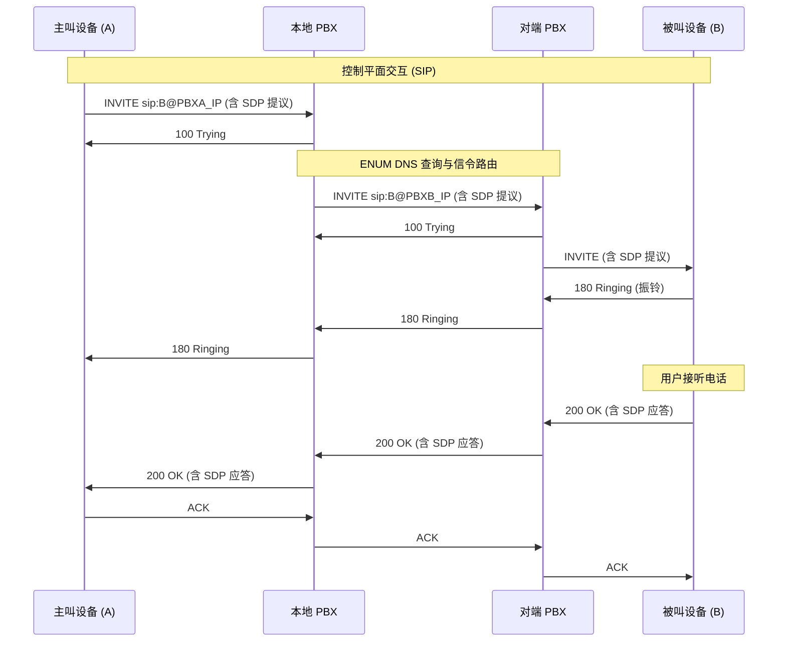
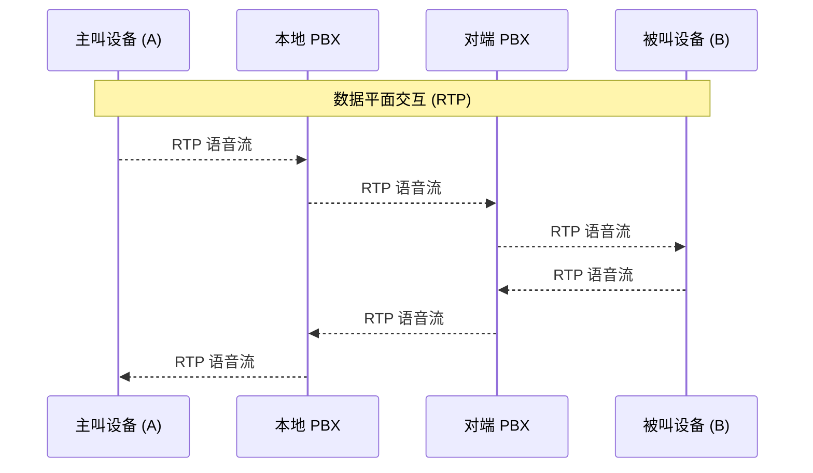

> Note: Since my understanding of telephone networks is still at a beginner stage, this blog is merely a summary of my preliminary learning. It is far from complete and may contain factual errors. If you spot any mistakes or have feedback, please contact me at 070127andy@gmail.com. Thank you for your understanding and corrections!


:::alert{type="info"}
Note: This article assumes you have already joined DN42 and peered with at least one peer.
:::


> Some of the basic concepts and diagrams in this article are adapted from Yukari Chiba's "The Complete Guide to telephony42". The original work is licensed under CC BY-SA 4.0, and the corresponding parts of this article are also published under CC BY-SA 4.0.
# Preface
I operate as **AS4242422921** in the DN42 network and own a small four-node cluster. The cluster uses a **FullMesh** **IBGP** topology, with **OSPF** as the **IGP** protocol for internal dynamic routing. I also registered **andy.dn42** as my domain and set up a **1 primary + 1 secondary** authoritative DNS setup (powered by Knot).
Recently, I saw [Yukari](https://0x7f.cc/) mention telephony42 in a DN42 group chat — an experimental decentralized telephone network. I thought building my own telephone network sounded cool, so I decided to follow Yukari's [blog post](https://0x7f.cc/telephony42-guide/) and build a [PBX (Private Branch Exchange)](https://en.wikipedia.org/wiki/Business_telephone_system) to connect to telephony42, ~~and prank-call my friends~~.
# Prerequisites
 - [x] A DN42 domain
 - [x] A server **already connected to DN42**, with at least 1 CPU core and 1 GB RAM
 - [x] Self-hosted authoritative DNS inside DN42 (demonstrated here with Knot)
# Concepts You Should Know
 *PS: This blog is only a "minimal getting-started guide". Advanced topics such as SRTP are still on my own learning list, so please research them yourself. This section references the content of 0x7f's blog.*


| Component | Brief Explanation |
| :--: | :--: |
| PBX (Private Branch Exchange) | Think of it as the router in a VoIP network. It handles signaling and routing, and sometimes the voice data itself. |
| B2BUA (Back-to-Back User Agent) | A PBX like Asterisk is a typical B2BUA. Unlike a SIP proxy that merely forwards signaling, when A calls B through a PBX, the PBX actually answers A's call as the callee first, then originates a brand-new call to B as the caller, and finally bridges these two independent legs internally. This allows the PBX to intervene in the call at any time — recording, transcoding, or even forcefully disconnecting. |
| Endpoint | Any device that can originate or receive calls. It can be a softphone app on a computer, a physical IP phone on a desk, an ATA, a WebRTC phone in a web page, or even the PBX of another network. |

---

| Protocol | Brief Explanation |
| :--: | :--: |
| Session Initiation Protocol (SIP - RFC 3261) | Serves as the control plane. It uses a plain-text format that looks somewhat like HTTP, containing URIs, header fields, and a body. It is mainly responsible for signaling — conveying the source and destination of a call, answer, hang-up, rejection, and so on — but does not carry the actual voice stream. SIP listens on UDP/TCP port 5060 by default (TCP is usually preferred for large messages), and on TCP port 5061 when TLS encryption is used. |
| Real-time Transport Protocol (RTP - RFC 3550) | Serves as the data plane. After the SIP handshake and SDP negotiation complete, both sides exchange RTP packets on the negotiated high dynamic ports (usually between UDP 10000 and 20000). These packets are extremely sensitive to latency and jitter. If the firewall only allows SIP (5060) but not RTP, you will encounter the most famous failure in VoIP history: one-way audio (the call connects but you hear nothing). |

---

| Routing | Brief Explanation |
| :--: | :--: |
| ENUM (E.164 Number Mapping) | A mechanism for automatically discovering routes. When dialing a number with an unknown destination, the PBX queries DNS NAPTR records based on the number to find the corresponding SIP target address. In DN42 this is implemented via a special DNS lookup. |
| Context | A key component of the Asterisk dialplan. You can think of it as a VRF in a VoIP system. It lets you drop untrusted external calls into an isolated context with no outbound dialing permission, and chain-jump between contexts using statements like Goto — very useful for features such as blocking spoofed caller IDs later on. |

---

Cross-network SIP calls can be divided into **three phases**:
## Part 1: SIP Call Setup
The PBX acts as a kind of "**relay station**": it first answers the calling device's **INVITE**, performs an **ENUM DNS** query (**explained in detail later**) and signaling routing, forwards the INVITE to the remote PBX once found, and the remote PBX then calls the callee device. After the callee answers, the 200 OK is relayed back hop by hop.

## Part 2: RTP Voice Transmission
Once connected, with the two PBXs acting as bridges, the two endpoints can exchange UDP packets — the RTP voice streams — around port 10000 (the range can be manually specified). *With `direct_media` disabled in this article, so media is anchored at the PBX*, all data is logically still relayed through the PBX.

## Part 3: SIP Hang-up
During hang-up, the BYE is still relayed through the PBXs, and a 200 OK is returned to complete the termination.

> From the above, we can see that the main processes all revolve around the PBX, so as long as we set up a PBX, we can preliminarily build our own telephone network. As for the **softswitch platform** for the PBX, Asterisk is a good choice for beginners.
> PS: Yukari compares the PBX to **an autonomous system of the telephone network**, and Asterisk to **the BIRD of the telephone network**.
# Let's Deploy
## 1. Creating the SIP Domain
Add to your `yourdomain.dn42` zone:
```yaml
sip.andy.dn42. 300 IN A     172.21.118.162  #ip对应你的PBX服务器
sip.andy.dn42. 300 IN AAAA  fdd2:e3e2:c922::2  #ip对应你的PBX服务器

pbx.andy.dn42. 300 IN CNAME sip.andy.dn42.
```
## 2. Setting Up ENUM (E.164 Number Mapping)
From the content above, we know that to call devices behind other PBXs, we must **know the other party's address**. So we need a mechanism to translate phone numbers into PBX IP addresses — this is **ENUM**.
ENUM is based on **DNS**. It works much like rDNS resolution: first reverse the phone number, separate the digits with dots, then append a specific domain suffix.
Finally, using the DNS **NAPTR** (Naming Authority Pointer) record — a record containing a regular expression — this reversed number string can be resolved into a SIP URI.
Below is a demo; this regex matches all numbers under the given prefix.
```yaml
$ORIGIN 4.3.2.1.0.4.2.4.tel.dn42.
*  IN  NAPTR  10  100  "u"  "E2U+sip"  "!^(.*)$!sip:\\1@pbx.yourdomain.dn42!" .
```
My authoritative DNS uses Knot. Here are the steps I took to create the ENUM zone:
#### 2.1 Calculate Your Own ENUM Zone from Your Number
- My number is `+042429211001`
- Remove the +: `042429211001`
- Reverse digit by digit and add dots: `1.0.0.1.1.2.9.2.4.2.4.0.tel.dn42.`
- Number prefix: `+04242921`
- Corresponding ENUM zone: `1.2.9.2.4.2.4.0.tel.dn42.`
#### 2.2 Create the Corresponding ENUM Zone
Create the zone file:
```txt
/var/lib/knot/zones/1.2.9.2.4.2.4.0.tel.dn42.zone
```
Contents:
```yaml
$ORIGIN 1.2.9.2.4.2.4.0.tel.dn42.
$TTL 300

@ IN SOA ns1.andy.dn42. admin.andy.dn42. (
    2026071001
    3600
    900
    604800
    300
)

@ IN NS ns1.andy.dn42.
@ IN NS ns2.andy.dn42.

; +042429211001   #我准备创建两个分机
1.0.0.1 300 IN NAPTR 100 10 "u" "E2U+sip" \
"!^.*$!sip:1001@sip.andy.dn42!" .

; +042429211002
2.0.0.1 300 IN NAPTR 100 10 "u" "E2U+sip" \
"!^.*$!sip:1002@sip.andy.dn42!" .
```
#### 2.3 Use ` kzonecheck ` to Validate the ENUM Zone File
```bash
kzonecheck -o "$ZONE" "$ZONEFILE"
```
An exit code of `0` means PASS.
#### 2.4 Create the Knot DNS Service Configuration File for the Primary NS
Example:
```yaml
key:
  - id: telephony42-xfr
    algorithm: hmac-sha256
    secret: "[数据删除]"

remote:
  - id: telephony42-secondary
    address: 172.21.118.164
    key: telephony42-xfr

acl:
  - id: telephony42-transfer
    key: telephony42-xfr
    action: transfer

zone:
  - domain: 1.2.9.2.4.2.4.0.tel.dn42.
    file: /var/lib/knot/zones/1.2.9.2.4.2.4.0.tel.dn42.zone
    notify: telephony42-secondary
    acl: telephony42-transfer
```
Add an include to the main configuration:
```yaml
include: "/etc/knot/conf.d/*.conf"
```
Check validity:
```bash
knotc conf-check
```
Set file permissions:
```bash
chown root:knot /etc/knot/conf.d
chmod 750 /etc/knot/conf.d

chown root:knot /etc/knot/conf.d/telephony42.conf
chmod 640 /etc/knot/conf.d/telephony42.conf

chown knot:knot /var/lib/knot/zones/1.2.9.2.4.2.4.0.tel.dn42.zone
chmod 640 /var/lib/knot/zones/1.2.9.2.4.2.4.0.tel.dn42.zone
```
Finally, reload `knot`.
#### 2.5 Sync to the Secondary Server
First generate the key:
```bash
umask 077

openssl rand -base64 32 > /root/telephony42-xfr.secret

chmod 600 /root/telephony42-xfr.secret
chown root:root /root/telephony42-xfr.secret

stat -c '%A %U:%G %s bytes %n' /root/telephony42-xfr.secret
```
Copy the key file to ns2, then run on ns2:
```bash
chmod 600 /root/telephony42-xfr.secret
chown root:root /root/telephony42-xfr.secret

stat -c '%A %U:%G %s bytes %n' /root/telephony42-xfr.secret  #查看权限是否正确
```
ns2 syncs from ns1 via AXFR.
Example:
```yaml
key:
  - id: telephony42-key
    algorithm: hmac-sha256
    secret: "[刚刚生成的密钥]"

remote:
  - id: ns1
    address: 172.21.118.161
    key: telephony42-key

zone:
  - domain: 1.2.9.2.4.2.4.0.tel.dn42
    master: ns1
```
Reload knot.
## 3. Install and Configure Asterisk
My system is Debian 13, whose default trixie repository does not include the full Asterisk main package, so I plan to compile and install it myself.
After asking an AI, I learned:
> The tutorial says you can install via APT because it implicitly uses the Debian sid repository. For a core node already running BIRD and other DN42 services, it is not recommended to mix in sid just for Asterisk, as it may cause base libraries to be upgraded en masse.
#### 3.1 Compile Asterisk from Source
Install the build dependencies:
```bash
apt install -y \
  build-essential pkg-config autoconf-archive bison flex \
  wget ca-certificates patch bzip2 python3-dev \
  libedit-dev libjansson-dev libsqlite3-dev uuid-dev libxml2-dev \
  libssl-dev libcurl4-openssl-dev liburiparser-dev libxslt1-dev \
  libcap-dev libnewt-dev libncurses-dev \
  libsrtp2-dev libgsm1-dev libspeexdsp-dev \
  libogg-dev libvorbis-dev \
  bind9-dnsutils
```
Download and extract Asterisk 22.10.1:
```bash
cd /usr/src
wget https://downloads.asterisk.org/pub/telephony/asterisk/releases/asterisk-22.10.1.tar.gz
tar -xzf asterisk-22.10.1.tar.gz
cd asterisk-22.10.1
```
Configure using Asterisk's bundled pjproject:
```bash
./configure --with-pjproject-bundled
make menuselect.makeopts
```
Enable the required modules:
```bash
for MODULE in \
  res_pjsip \
  chan_pjsip \
  res_pjsip_authenticator_digest \
  res_pjsip_endpoint_identifier_ip \
  res_pjsip_registrar \
  res_pjsip_session \
  res_pjsip_sdp_rtp \
  res_rtp_asterisk \
  func_enum \
  app_dial \
  app_echo \
  app_playback \
  pbx_config \
  codec_alaw \
  codec_ulaw \
  codec_g722
do
  menuselect/menuselect \
    --enable "$MODULE" \
    menuselect.makeopts
done
```
Since my VPS only has 1 core and 1 GB RAM, I compile single-threaded:
```bash
make -j1
```
Install when done:
```bash
make install
make samples
make config
make install-logrotate
ldconfig
```
#### 3.2 Create the Asterisk User
Officially, Asterisk is recommended to run with low privileges, so create a dedicated user:
```bash
groupadd --system asterisk

useradd \
  --system \
  --gid asterisk \
  --home-dir /var/lib/asterisk \
  --shell /usr/sbin/nologin \
  asterisk
  ```
  Prepare the directories:
  ```bash
install -d -o asterisk -g asterisk /run/asterisk
install -d -o asterisk -g asterisk /var/log/asterisk
install -d -o asterisk -g asterisk /var/spool/asterisk
install -d -o asterisk -g asterisk /var/lib/asterisk
```
Finally, register the system service and enable auto-start.
#### 3.3 Configure Asterisk
- First and most important: **Asterisk should only listen on the DN42 internal subnets! Prevent public-internet SIP scanning and brute-force registration!**
```yaml
172.21.118.162:5060/UDP
[fdd2:e3e2:c922::2]:5060/UDP
```

#### 3.4 Create PJSIP Extensions
I plan to create two extensions:
```yaml
1001：Windows Blink
1002：iOS SIP 客户端

1001 → +042429211001
1002 → +042429211002
```
Core configuration:
```ini
[transport-dn42-ipv4]
type=transport
protocol=udp
bind=172.21.118.162:5060
local_net=172.20.0.0/14

[transport-dn42-ipv6]
type=transport
protocol=udp
bind=[fdd2:e3e2:c922::2]:5060
local_net=fd00::/8
```
Extension template:
```ini
[local-endpoint](!)
type=endpoint
context=from-local
disallow=all
allow=g722
allow=alaw
allow=ulaw
direct_media=no
rtp_symmetric=yes
force_rport=yes
rewrite_contact=yes
dtmf_mode=rfc4733
```
> Note: DNS NAPTR defines how external numbers find local extensions; the Telephony42 caller number used when an extension dials out needs to be set separately via the endpoint's callerid or the dialplan.
#### 3.5 Narrow the RTP Range
My internal network currently has only two extensions, so I decided to narrow the RTP ports to: `UDP 10000–10100`
```ini
[general]
rtpstart=10000
rtpend=10100
strictrtp=yes
```
#### 3.6 Dialplan
My internal numbers:
 `1001    1002`
I plan to use one number for a local ECHO test:
 `5000`
My core dialplan:
```bash
[from-local]
exten => _XXXX,1,NoOp(Local call)
 same => n,Goto(local-extensions,${EXTEN},1)

[local-extensions]
exten => 1001,1,Dial(PJSIP/1001,30)
 same => n,Hangup()

exten => 1002,1,Dial(PJSIP/1002,30)
 same => n,Hangup()

exten => 5000,1,Answer()
 same => n,Wait(1)
 same => n,Echo()
 same => n,Hangup()
 ```
Finally, verify the modules are working:
```bash
asterisk -rx 'module show like chan_pjsip'
asterisk -rx 'module show like res_pjsip'
asterisk -rx 'module show like res_rtp_asterisk'
asterisk -rx 'module show like func_enum'
asterisk -rx 'core show application Echo'
asterisk -rx 'core show function ENUMLOOKUP'
```
Reload Asterisk:
```bash
asterisk -rx "pjsip reload"
```
#### 3.7 Deploy Split-Horizon DNS on the PBX
Since the PBX's default DNS cannot resolve tel.dn42, you should deploy dnsmasq to split-horizon the following domains:
```txt
<yourdomain>.dn42
tel.dn42
```
Install dnsmasq:
```bash
apt install -y dnsmasq
```
My configuration file example:
 `/etc/dnsmasq.d/dn42.conf`
```ini
server=/andy.dn42/172.21.118.161
server=/andy.dn42/172.21.118.164

server=/tel.dn42/172.21.118.161
server=/tel.dn42/172.21.118.164
#注：Knot DNS 只实现权威 DNS 服务，不是递归解析器，上面两行请设置成自己的权威DNS！
listen-address=127.0.0.1
bind-interfaces
```
Restart dnsmasq (since the **listen address** changed, a hot reload is not possible):
```bash
systemctl restart dnsmasq
```
Test in Asterisk:
```bash
asterisk -rx \
  'dialplan eval function ENUMLOOKUP(+042429211001,sip,u,1,tel.dn42)'
```
If everything works, it should return:
```bash
sip:1001@sip.andy.dn42
```
#### 3.8 Configure the Telephony42 Outbound Dialplan
Since ENUM only tells Asterisk "who to call", Asterisk still needs to decide which PJSIP endpoint to use for the call, and so on. Therefore we need a generic outbound template `peer-enum-outbound`.
So configure a registration-free outbound endpoint in `pjsip.conf`.
Example:
```ini
[peer-enum-outbound]
type=endpoint
transport=transport-udp
context=from-enum
disallow=all
allow=ulaw
allow=alaw
aors=peer-enum-outbound
direct_media=no

[peer-enum-outbound]
type=aor
```
The actual target is determined by the SIP URI returned by ENUM.
#### 3.9 Configure the Telephony42 Outbound Dialplan
Add to `extensions.conf`:
```ini
[internal]
exten => _+X.,1,NoOp(Telephony42 outbound: ${EXTEN})
 same => n,Set(ENUMURI=${ENUMLOOKUP(${EXTEN},sip,u,1,tel.dn42)})
 same => n,Set(ENUMURI=${ENUMLOOKUP(${ENUMNUM},sip,,1,tel.dn42)})
 same => n,NoOp(ENUM result: ${ENUMURI})
 same => n,GotoIf($["${ENUMURI}"=""]?enum-failed)
 same => n,Dial(PJSIP/${ENUMURI}@peer-enum-outbound,60)
 same => n,Hangup()

 same => n(enum-failed),Playback(invalid)
 same => n,Hangup()
 ```
 Reload Asterisk:
 ```bash
asterisk -rx "pjsip reload"
asterisk -rx "dialplan reload"
```
 At this point, dialing `+042429211002` from `1001` should already work.
  **It is recommended to use `sngrep` for call-flow analysis — it is a TUI packet-capture and visualization tool dedicated to SIP (with color highlighting).**
#### 3.10 Configure Telephony42 Inbound SIP
To receive calls from other Telephony42 nodes, you need to set up an inbound endpoint.
Example:
```ini
[peer-enum-inbound]
type=endpoint
transport=transport-udp
context=context-enum
disallow=all
allow=ulaw
allow=alaw
direct_media=no
```
Then add an identify section so SIP packets from DN42 match this endpoint.
```ini
[peer-enum-inbound-identify-v4]
type=identify
endpoint=peer-enum-inbound
match=10.0.0.0/8
match=172.20.0.0/14
match=172.31.0.0/16

[peer-enum-inbound-identify-v6]
type=identify
endpoint=peer-enum-inbound
match=fd00::/8
```
Once again: **never put the public internet 0.0.0.0/0 in there!!**
#### 3.11 Configure a Dedicated Inbound Context
On inbound calls, the call is first routed into a dedicated context.
```ini
[context-enum]
exten => 1001,1,NoOp(Telephony42 inbound to 1001)
 same => n,Dial(PJSIP/1001,30)
 same => n,Hangup()

exten => 1002,1,NoOp(Telephony42 inbound to 1002)
 same => n,Dial(PJSIP/1002,30)
 same => n,Hangup()
 ```
 Reload Asterisk.
 ** Note: a dedicated inbound context can only restrict the dialing permissions of external calls; it cannot prove that the CallerID is genuine.**
## 4. Submit the Telephony42 Registry
```ini
telephony:          +04242921
nserver:            ns1.andy.dn42
nserver:            ns2.andy.dn42
admin-c:            ANDY-DN42
tech-c:             ANDY-DN42
mnt-by:             ANDY-MNT
source:             DN42
```
## 5. Verify After the PR Is Merged
Once the parent zone delegation takes effect, you can query using the DN42 recursive DNS.
```bash
ZONE="1.2.9.2.4.2.4.0.tel.dn42."
#检查 NS：
dig @172.20.0.53 "$ZONE" NS \
  +noall +answer +authority
#正常应显示：
#ns1.andy.dn42.
#ns2.andy.dn42.
```
At this point, it's done! Go visit yp.dn42 and dial some ~~weird~~ numbers!
# References:
-  [The Complete Guide to telephony42: Building a Telephone Network on dn42 from Scratch](https://0x7f.cc/telephony42-guide/)
-  [Configuring E.164 ENUM in Telephony42](https://0x7f.cc/e164-dn42/)

