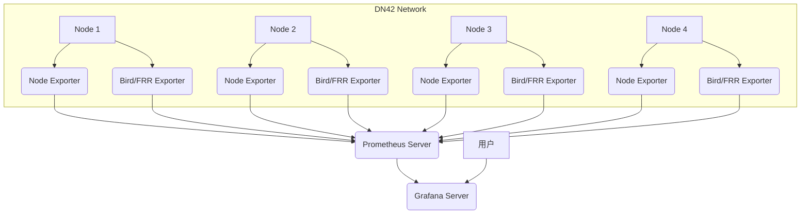

# Preface
I run 4 nodes in the dn42 network. I had already set up LookingGlass to monitor node status, but it wasn't intuitive enough ~~actually I just wanted to tinker~~, so I decided to build a dashboard that graphically monitors the Bird status of each node. In the community I found that this can be done with Grafana plus Prometheus as the data source.
The topology is as follows:



# Setup
## Deploying the Prometheus Server

The Prometheus Server will run on a dedicated monitoring server.

####  Create the working directory

```bash
mkdir -p /opt/prometheus/config /opt/prometheus/data
```

####  Create the Prometheus configuration file (`/opt/prometheus/config/prometheus.yml`)

```yaml
global:
  scrape_interval: 15s # 默认抓取间隔

scrape_configs:
  - job_name: 'prometheus'
    static_configs:
      - targets: ['localhost:9090'] # 监控 Prometheus 自身

  - job_name: 'node_exporter'
    static_configs:
      - targets: ['<node1_ip>:9100', '<node2_ip>:9100', '<node3_ip>:9100', '<node4_ip>:9100'] # 替换为您的 DN42 节点 IP

  - job_name: 'bird_exporter'
    static_configs:
      - targets: ['<node1_ip>:9324', '<node2_ip>:9324', '<node3_ip>:9324', '<node4_ip>:9324'] # 替换为您的 DN42 节点 IP
```

**Note**: Replace `<nodeX_ip>` with the actual IP addresses of your DN42 nodes.

####  Deploy Prometheus with Docker Compose

Create a `docker-compose.yml` file:

```yaml
services:
  prometheus:
    image: prom/prometheus
    container_name: prometheus
    network_mode: host
    ports:
      - "9090:9090"
    volumes:
      - /opt/prometheus/config/prometheus.yml:/etc/prometheus/prometheus.yml
      - /opt/prometheus/data:/prometheus
    command:
      - '--config.file=/etc/prometheus/prometheus.yml'
      - '--storage.tsdb.path=/prometheus'
      - '--web.enable-lifecycle'
    restart: unless-stopped
```

Grant ownership of the data directory to the Prometheus user:

```bash
chown -R 65534:65534 /opt/prometheus/data
```

Start Prometheus:

```bash
docker-compose up -d
```

Verify that Prometheus is running properly by visiting `http://<monitoring_server_IP>:9090`.

## Deploying Node Exporter (on each DN42 node)
#### Create the working directory

```bash
mkdir -p /opt/node_exporter
```

#### Method 1: Deploy Node Exporter with Docker

```bash
docker run -d \
  --name node_exporter \
  --net="host" \
  --pid="host" \
  -v "/:/host:ro,rslave" \
  quay.io/prometheus/node-exporter:latest \
  --path.rootfs=/host
```

#### Method 2: Deploy Node Exporter with the binary executable

1.  **Download and extract Node Exporter**

    Visit the [Prometheus download page](https://prometheus.io/download/) to get the latest version of Node Exporter. The example below uses version `1.7.0`

    ```bash
    wget https://github.com/prometheus/node_exporter/releases/download/v1.7.0/node_exporter-1.7.0.linux-amd64.tar.gz
    tar xvfz node_exporter-1.7.0.linux-amd64.tar.gz
    sudo cp node_exporter-1.7.0.linux-amd64/node_exporter /usr/local/bin
    sudo chown prometheus:prometheus /usr/local/bin/node_exporter
    rm -rf node_exporter-1.7.0.linux-amd64.tar.gz node_exporter-1.7.0.linux-amd64
    ```

2.  **Create the Systemd service file (`/etc/systemd/system/node_exporter.service`)**

    ```ini
    [Unit]
    Description=Node Exporter
    Wants=network-online.target
    After=network-online.target

    [Service]
    Type=simple
    ExecStart=/usr/local/bin/node_exporter \
      --web.listen-address=":9100" \
      --collector.textfile.directory="/var/lib/node_exporter/textfile_collector"

    [Install]
    WantedBy=multi-user.target
    ```

3.  **Reload Systemd and start Node Exporter**

    ```bash
    sudo systemctl daemon-reload
    sudo systemctl start node_exporter
    sudo systemctl enable node_exporter
    ```

#### Bird Exporter

First, make sure the BIRD configuration allows `bird_exporter` to access its control socket. You usually need to add something like the following to `/etc/bird/bird.conf` or `/etc/bird2/bird.conf`:

```
control socket "/var/run/bird/bird.ctl" mode 0777;
```

Then deploy Bird Exporter with Docker (recommended for nodes with sufficient memory):

```bash
docker run -d \
  --name bird_exporter \
  --network host \
  -v /var/run/bird/bird.ctl:/var/run/bird/bird.ctl \
  czerwonk/bird_exporter:latest
```

#### Deploying Bird Exporter with the binary
1.  **Download and extract Bird Exporter**

    Visit [Bird Exporter GitHub Releases](https://github.com/czerwonk/bird_exporter/releases) to get the latest version of Bird Exporter. The example below uses version `1.1.0`; replace it according to your actual situation.

    ```bash
    wget https://github.com/czerwonk/bird_exporter/releases/download/v1.1.0/bird_exporter-1.1.0.linux-amd64.tar.gz
    tar xvfz bird_exporter-1.1.0.linux-amd64.tar.gz
    sudo cp bird_exporter-1.1.0.linux-amd64/bird_exporter /usr/local/bin
    sudo chown prometheus:prometheus /usr/local/bin/bird_exporter
    rm -rf bird_exporter-1.1.0.linux-amd64.tar.gz bird_exporter-1.1.0.linux-amd64
    ```

2.  **Create the Systemd service file (`/etc/systemd/system/bird_exporter.service`)**

    ```ini
    [Unit]
    Description=Bird Exporter
    Wants=network-online.target
    After=network-online.target

    [Service]
    Type=simple
    ExecStart=/usr/local/bin/bird_exporter \
      --bird.socket="/var/run/bird/bird.ctl" \
      --web.listen-address=":9324"

    [Install]
    WantedBy=multi-user.target
    ```

3.  **Reload Systemd and start Bird Exporter**

    ```bash
    sudo systemctl daemon-reload
    sudo systemctl start bird_exporter
    sudo systemctl enable bird_exporter
    ```
### Deploying the Grafana Server

It is recommended to deploy the Grafana Server on the same monitoring server as the Prometheus Server.

#### Create the working directory

```bash
mkdir -p /opt/grafana/data
```

#### 4.4.2 Deploy Grafana with Docker Compose

Update the previously created `docker-compose.yml` file by adding the Grafana service:

```yaml
services:
  prometheus:
    image: prom/prometheus
    container_name: prometheus
    ports:
      - "9090:9090"
    volumes:
      - /opt/prometheus/config/prometheus.yml:/etc/prometheus/prometheus.yml
      - /opt/prometheus/data:/prometheus
    command:
      - '--config.file=/etc/prometheus/prometheus.yml'
      - '--storage.tsdb.path=/prometheus'
      - '--web.enable-lifecycle'
    restart: unless-stopped

  grafana:
    image: grafana/grafana
    container_name: grafana
    ports:
      - "3000:3000"
    volumes:
      - /opt/grafana/data:/var/lib/grafana
    environment:
      - GF_SECURITY_ADMIN_USER=admin
      - GF_SECURITY_ADMIN_PASSWORD=your_strong_password # 请替换为强密码
    depends_on:
      - prometheus
    restart: unless-stopped
```

Restart the Docker Compose services to start Grafana:

```bash
docker-compose up -d
```

### Configuring the Grafana Data Source

1.  Log in to Grafana.
2.  In the left navigation bar, click the gear icon (Configuration) -> Data Sources.
3.  Click
`Add data source`.
4.  Select `Prometheus`.
5.  In the `URL` field of the `HTTP` section, enter `http://prometheus:9090` (if Prometheus and Grafana are in the same Docker Compose network) or `http://localhost:9090` (if Prometheus runs on the host and Grafana can access it directly).
6.  Click `Save & Test`. If everything is working, you will see the message `Data source is working`.

## Importing Grafana Dashboards

The Grafana community provides many ready-made dashboards that greatly simplify monitoring configuration. Here are some recommended dashboard IDs:

*   **Node Exporter Full**: ID `1860` (or search for `Node Exporter Full`), used to monitor host OS metrics.
*   **BIRD RS**: ID `5259` (or search for `BIRD RS`), used to monitor BIRD routing protocol status.
*   **FRR Exporter - BGP**: ID `22943` (or search for `FRR Exporter - BGP`), used to monitor FRR BGP status.

#### Import Steps

1.  In the Grafana left navigation bar, click the `+` icon (Create) -> `Import`.
2.  Enter one of the dashboard IDs above in the `Import via grafana.com` field, then click `Load`.
3.  Select your Prometheus data source.
4.  Click `Import`.

Repeat this process to import all the dashboards you need.

## Alert Configuration (Optional)

Grafana allows you to configure alert rules based on the metrics collected by Prometheus. When a metric reaches a preset threshold, Grafana can send notifications via email, Slack, Webhook, and other methods.

#### Configuring Notification Channels

1.  In the Grafana left navigation bar, click the gear icon (Configuration) -> `Alerting` -> `Notification channels`.
2.  Click `New channel`.
3.  Select your preferred notification type (e.g. `Email`, `Slack`) and fill in the relevant configuration information.
4.  Click `Save`.

#### Creating Alert Rules

1.  Open the dashboard you want to add alerts to.
2.  Select a panel, click the panel title, then choose `Edit`.
3.  In the panel editing view, switch to the `Alert` tab.
4.  Click `Create Alert`.
5.  Define the alert rule's conditions, evaluation interval, and notification channel.
6.  Click `Save`.
7.  Sharing my JSON


:::collapse{label="Sample"}
```json
{
    "annotations":  {
                        "list":  [
                                     {
                                         "builtIn":  1,
                                         "datasource":  {
                                                            "uid":  "-- Grafana --"
                                                        },
                                         "enable":  true,
                                         "hide":  true,
                                         "iconColor":  "rgba(0, 211, 255, 1)",
                                         "name":  "Annotations \u0026 Alerts",
                                         "type":  "dashboard"
                                     }
                                 ]
                    },
    "description":  "Live BIRD routing health, prefix visibility, session status and routing activity across all monitored routers.",
    "editable":  true,
    "fiscalYearStartMonth":  0,
    "graphTooltip":  1,
    "id":  6,
    "links":  [

              ],
    "panels":  [
                   {
                       "datasource":  {
                                          "type":  "prometheus",
                                          "uid":  "dfdlzb2hrvlz4b"
                                      },
                       "description":  "Healthy Prometheus scrape targets for the selected BIRD exporters.",
                       "fieldConfig":  {
                                           "defaults":  {
                                                            "color":  {
                                                                          "mode":  "thresholds"
                                                                      },
                                                            "mappings":  [

                                                                         ],
                                                            "thresholds":  {
                                                                               "mode":  "absolute",
                                                                               "steps":  [
                                                                                             {
                                                                                                 "color":  "red",
                                                                                                 "value":  0
                                                                                             },
                                                                                             {
                                                                                                 "color":  "green",
                                                                                                 "value":  1
                                                                                             }
                                                                                         ]
                                                                           },
                                                            "unit":  "short"
                                                        },
                                           "overrides":  [

                                                         ]
                                       },
                       "gridPos":  {
                                       "h":  4,
                                       "w":  6,
                                       "x":  0,
                                       "y":  0
                                   },
                       "id":  10,
                       "options":  {
                                       "colorMode":  "background_solid",
                                       "graphMode":  "none",
                                       "justifyMode":  "center",
                                       "orientation":  "horizontal",
                                       "percentChangeColorMode":  "standard",
                                       "reduceOptions":  {
                                                             "calcs":  [
                                                                           "lastNotNull"
                                                                       ],
                                                             "fields":  "",
                                                             "values":  false
                                                         },
                                       "showPercentChange":  false,
                                       "textMode":  "auto",
                                       "wideLayout":  true
                                   },
                       "pluginVersion":  "12.3.3",
                       "targets":  [
                                       {
                                           "datasource":  {
                                                              "type":  "prometheus",
                                                              "uid":  "dfdlzb2hrvlz4b"
                                                          },
                                           "editorMode":  "code",
                                           "expr":  "count(up{job=\"bird_exporter\",instance=~\"$instance\"} == 1) or vector(0)",
                                           "format":  "time_series",
                                           "instant":  true,
                                           "legendFormat":  "__auto",
                                           "range":  false,
                                           "refId":  "A"
                                       }
                                   ],
                       "title":  "BIRD Exporters Online",
                       "type":  "stat"
                   },
                   {
                       "datasource":  {
                                          "type":  "prometheus",
                                          "uid":  "dfdlzb2hrvlz4b"
                                      },
                       "description":  "Established BGP sessions across the selected router scope.",
                       "fieldConfig":  {
                                           "defaults":  {
                                                            "color":  {
                                                                          "mode":  "thresholds"
                                                                      },
                                                            "mappings":  [

                                                                         ],
                                                            "thresholds":  {
                                                                               "mode":  "absolute",
                                                                               "steps":  [
                                                                                             {
                                                                                                 "color":  "red",
                                                                                                 "value":  0
                                                                                             },
                                                                                             {
                                                                                                 "color":  "green",
                                                                                                 "value":  1
                                                                                             }
                                                                                         ]
                                                                           },
                                                            "unit":  "short"
                                                        },
                                           "overrides":  [

                                                         ]
                                       },
                       "gridPos":  {
                                       "h":  4,
                                       "w":  6,
                                       "x":  6,
                                       "y":  0
                                   },
                       "id":  11,
                       "options":  {
                                       "colorMode":  "background_solid",
                                       "graphMode":  "none",
                                       "justifyMode":  "center",
                                       "orientation":  "horizontal",
                                       "percentChangeColorMode":  "standard",
                                       "reduceOptions":  {
                                                             "calcs":  [
                                                                           "lastNotNull"
                                                                       ],
                                                             "fields":  "",
                                                             "values":  false
                                                         },
                                       "showPercentChange":  false,
                                       "textMode":  "auto",
                                       "wideLayout":  true
                                   },
                       "pluginVersion":  "12.3.3",
                       "targets":  [
                                       {
                                           "datasource":  {
                                                              "type":  "prometheus",
                                                              "uid":  "dfdlzb2hrvlz4b"
                                                          },
                                           "editorMode":  "code",
                                           "expr":  "count(bird_protocol_up{proto=\"BGP\",instance=~\"$instance\"} == 1) or vector(0)",
                                           "format":  "time_series",
                                           "instant":  true,
                                           "legendFormat":  "__auto",
                                           "range":  false,
                                           "refId":  "A"
                                       }
                                   ],
                       "title":  "BGP Sessions Up",
                       "type":  "stat"
                   },
                   {
                       "datasource":  {
                                          "type":  "prometheus",
                                          "uid":  "dfdlzb2hrvlz4b"
                                      },
                       "description":  "BGP sessions currently not established.",
                       "fieldConfig":  {
                                           "defaults":  {
                                                            "color":  {
                                                                          "mode":  "thresholds"
                                                                      },
                                                            "mappings":  [

                                                                         ],
                                                            "thresholds":  {
                                                                               "mode":  "absolute",
                                                                               "steps":  [
                                                                                             {
                                                                                                 "color":  "green",
                                                                                                 "value":  0
                                                                                             },
                                                                                             {
                                                                                                 "color":  "red",
                                                                                                 "value":  1
                                                                                             }
                                                                                         ]
                                                                           },
                                                            "unit":  "short"
                                                        },
                                           "overrides":  [

                                                         ]
                                       },
                       "gridPos":  {
                                       "h":  4,
                                       "w":  6,
                                       "x":  12,
                                       "y":  0
                                   },
                       "id":  12,
                       "options":  {
                                       "colorMode":  "background_solid",
                                       "graphMode":  "none",
                                       "justifyMode":  "center",
                                       "orientation":  "horizontal",
                                       "percentChangeColorMode":  "standard",
                                       "reduceOptions":  {
                                                             "calcs":  [
                                                                           "lastNotNull"
                                                                       ],
                                                             "fields":  "",
                                                             "values":  false
                                                         },
                                       "showPercentChange":  false,
                                       "textMode":  "auto",
                                       "wideLayout":  true
                                   },
                       "pluginVersion":  "12.3.3",
                       "targets":  [
                                       {
                                           "datasource":  {
                                                              "type":  "prometheus",
                                                              "uid":  "dfdlzb2hrvlz4b"
                                                          },
                                           "editorMode":  "code",
                                           "expr":  "count(bird_protocol_up{proto=\"BGP\",instance=~\"$instance\"} == 0) or vector(0)",
                                           "format":  "time_series",
                                           "instant":  true,
                                           "legendFormat":  "__auto",
                                           "range":  false,
                                           "refId":  "A"
                                       }
                                   ],
                       "title":  "BGP Sessions Down",
                       "type":  "stat"
                   },
                   {
                       "datasource":  {
                                          "type":  "prometheus",
                                          "uid":  "dfdlzb2hrvlz4b"
                                      },
                       "description":  "Total adjacent OSPF and OSPFv3 neighbors.",
                       "fieldConfig":  {
                                           "defaults":  {
                                                            "color":  {
                                                                          "mode":  "thresholds"
                                                                      },
                                                            "mappings":  [

                                                                         ],
                                                            "thresholds":  {
                                                                               "mode":  "absolute",
                                                                               "steps":  [
                                                                                             {
                                                                                                 "color":  "red",
                                                                                                 "value":  0
                                                                                             },
                                                                                             {
                                                                                                 "color":  "green",
                                                                                                 "value":  1
                                                                                             }
                                                                                         ]
                                                                           },
                                                            "unit":  "short"
                                                        },
                                           "overrides":  [

                                                         ]
                                       },
                       "gridPos":  {
                                       "h":  4,
                                       "w":  6,
                                       "x":  18,
                                       "y":  0
                                   },
                       "id":  13,
                       "options":  {
                                       "colorMode":  "background_solid",
                                       "graphMode":  "none",
                                       "justifyMode":  "center",
                                       "orientation":  "horizontal",
                                       "percentChangeColorMode":  "standard",
                                       "reduceOptions":  {
                                                             "calcs":  [
                                                                           "lastNotNull"
                                                                       ],
                                                             "fields":  "",
                                                             "values":  false
                                                         },
                                       "showPercentChange":  false,
                                       "textMode":  "auto",
                                       "wideLayout":  true
                                   },
                       "pluginVersion":  "12.3.3",
                       "targets":  [
                                       {
                                           "datasource":  {
                                                              "type":  "prometheus",
                                                              "uid":  "dfdlzb2hrvlz4b"
                                                          },
                                           "editorMode":  "code",
                                           "expr":  "(sum(bird_ospf_neighbor_adjacent_count{instance=~\"$instance\"}) or vector(0)) + (sum(bird_ospfv3_neighbor_adjacent_count{instance=~\"$instance\"}) or vector(0))",
                                           "format":  "time_series",
                                           "instant":  true,
                                           "legendFormat":  "__auto",
                                           "range":  false,
                                           "refId":  "A"
                                       }
                                   ],
                       "title":  "OSPF Adjacent Neighbors",
                       "type":  "stat"
                   },
                   {
                       "datasource":  {
                                          "type":  "prometheus",
                                          "uid":  "dfdlzb2hrvlz4b"
                                      },
                       "description":  "Prefixes advertised to PITER-IX peers across the selected time range.",
                       "fieldConfig":  {
                                           "defaults":  {
                                                            "color":  {
                                                                          "mode":  "palette-classic"
                                                                      },
                                                            "custom":  {
                                                                           "axisBorderShow":  false,
                                                                           "axisCenteredZero":  false,
                                                                           "axisColorMode":  "text",
                                                                           "axisLabel":  "",
                                                                           "axisPlacement":  "left",
                                                                           "barAlignment":  0,
                                                                           "barWidthFactor":  0.6,
                                                                           "drawStyle":  "line",
                                                                           "fillOpacity":  0,
                                                                           "gradientMode":  "none",
                                                                           "hideFrom":  {
                                                                                            "legend":  false,
                                                                                            "tooltip":  false,
                                                                                            "viz":  false
                                                                                        },
                                                                           "insertNulls":  false,
                                                                           "lineInterpolation":  "stepAfter",
                                                                           "lineWidth":  2,
                                                                           "pointSize":  5,
                                                                           "scaleDistribution":  {
                                                                                                     "type":  "linear"
                                                                                                 },
                                                                           "showPoints":  "never",
                                                                           "showValues":  false,
                                                                           "spanNulls":  false,
                                                                           "stacking":  {
                                                                                            "group":  "A",
                                                                                            "mode":  "none"
                                                                                        },
                                                                           "thresholdsStyle":  {
                                                                                                   "mode":  "off"
                                                                                               }
                                                                       },
                                                            "mappings":  [

                                                                         ],
                                                            "thresholds":  {
                                                                               "mode":  "absolute",
                                                                               "steps":  [
                                                                                             {
                                                                                                 "color":  "green",
                                                                                                 "value":  0
                                                                                             },
                                                                                             {
                                                                                                 "color":  "red",
                                                                                                 "value":  80
                                                                                             }
                                                                                         ]
                                                                           },
                                                            "unit":  "short"
                                                        },
                                           "overrides":  [
                                                             {
                                                                 "matcher":  {
                                                                                 "id":  "byValue",
                                                                                 "options":  {
                                                                                                 "op":  "gte",
                                                                                                 "reducer":  "allIsZero",
                                                                                                 "value":  0
                                                                                             }
                                                                             },
                                                                 "properties":  [
                                                                                    {
                                                                                        "id":  "custom.hideFrom",
                                                                                        "value":  {
                                                                                                      "legend":  true,
                                                                                                      "tooltip":  true,
                                                                                                      "viz":  false
                                                                                                  }
                                                                                    }
                                                                                ]
                                                             },
                                                             {
                                                                 "matcher":  {
                                                                                 "id":  "byValue",
                                                                                 "options":  {
                                                                                                 "op":  "gte",
                                                                                                 "reducer":  "allIsNull",
                                                                                                 "value":  0
                                                                                             }
                                                                             },
                                                                 "properties":  [
                                                                                    {
                                                                                        "id":  "custom.hideFrom",
                                                                                        "value":  {
                                                                                                      "legend":  true,
                                                                                                      "tooltip":  true,
                                                                                                      "viz":  false
                                                                                                  }
                                                                                    }
                                                                                ]
                                                             },
                                                             {
                                                                 "matcher":  {
                                                                                 "id":  "byValue",
                                                                                 "options":  {
                                                                                                 "op":  "gte",
                                                                                                 "reducer":  "allIsZero",
                                                                                                 "value":  0
                                                                                             }
                                                                             },
                                                                 "properties":  [
                                                                                    {
                                                                                        "id":  "custom.hideFrom",
                                                                                        "value":  {
                                                                                                      "legend":  true,
                                                                                                      "tooltip":  true,
                                                                                                      "viz":  false
                                                                                                  }
                                                                                    }
                                                                                ]
                                                             },
                                                             {
                                                                 "matcher":  {
                                                                                 "id":  "byValue",
                                                                                 "options":  {
                                                                                                 "op":  "gte",
                                                                                                 "reducer":  "allIsNull",
                                                                                                 "value":  0
                                                                                             }
                                                                             },
                                                                 "properties":  [
                                                                                    {
                                                                                        "id":  "custom.hideFrom",
                                                                                        "value":  {
                                                                                                      "legend":  true,
                                                                                                      "tooltip":  true,
                                                                                                      "viz":  false
                                                                                                  }
                                                                                    }
                                                                                ]
                                                             },
                                                             {
                                                                 "matcher":  {
                                                                                 "id":  "byValue",
                                                                                 "options":  {
                                                                                                 "op":  "gte",
                                                                                                 "reducer":  "allIsZero",
                                                                                                 "value":  0
                                                                                             }
                                                                             },
                                                                 "properties":  [
                                                                                    {
                                                                                        "id":  "custom.hideFrom",
                                                                                        "value":  {
                                                                                                      "legend":  true,
                                                                                                      "tooltip":  true,
                                                                                                      "viz":  false
                                                                                                  }
                                                                                    }
                                                                                ]
                                                             },
                                                             {
                                                                 "matcher":  {
                                                                                 "id":  "byValue",
                                                                                 "options":  {
                                                                                                 "op":  "gte",
                                                                                                 "reducer":  "allIsNull",
                                                                                                 "value":  0
                                                                                             }
                                                                             },
                                                                 "properties":  [
                                                                                    {
                                                                                        "id":  "custom.hideFrom",
                                                                                        "value":  {
                                                                                                      "legend":  true,
                                                                                                      "tooltip":  true,
                                                                                                      "viz":  false
                                                                                                  }
                                                                                    }
                                                                                ]
                                                             }
                                                         ]
                                       },
                       "gridPos":  {
                                       "h":  8,
                                       "w":  12,
                                       "x":  0,
                                       "y":  4
                                   },
                       "id":  2,
                       "options":  {
                                       "legend":  {
                                                      "calcs":  [
                                                                    "lastNotNull"
                                                                ],
                                                      "displayMode":  "table",
                                                      "placement":  "bottom",
                                                      "showLegend":  true
                                                  },
                                       "tooltip":  {
                                                       "hideZeros":  true,
                                                       "mode":  "multi",
                                                       "sort":  "desc"
                                                   }
                                   },
                       "pluginVersion":  "12.3.3",
                       "targets":  [
                                       {
                                           "datasource":  {
                                                              "type":  "prometheus",
                                                              "uid":  "dfdlzb2hrvlz4b"
                                                          },
                                           "dateTimeType":  "DATETIME",
                                           "editorMode":  "code",
                                           "expr":  "bird_protocol_prefix_export_count{\n  instance=~\"$instance\",\r\n  name=~\"(dn42_peer_|dn42_)[0-9a-zA-Z]+\", \r\n  name!~\"dn42_ospf\",\r\n  name!~\"dn42_ospf6\", \r\n  ip_version=\"4\"\r\n} \u003e 0\r\n",
                                           "format":  "time_series",
                                           "formattedQuery":  "SELECT $timeSeries as t, count() FROM $table WHERE $timeFilter GROUP BY t ORDER BY t",
                                           "intervalFactor":  1,
                                           "legendFormat":  "{{name}}",
                                           "query":  "SELECT\n    $timeSeries as t,\n    count()\nFROM $table\nWHERE $timeFilter\nGROUP BY t\nORDER BY t",
                                           "range":  true,
                                           "refId":  "A",
                                           "round":  "0s"
                                       }
                                   ],
                       "title":  "PITER-IX · Exported Prefixes",
                       "type":  "timeseries"
                   },
                   {
                       "datasource":  {
                                          "type":  "prometheus",
                                          "uid":  "dfdlzb2hrvlz4b"
                                      },
                       "description":  "Prefixes received from PITER-IX peers across the selected time range.",
                       "fieldConfig":  {
                                           "defaults":  {
                                                            "color":  {
                                                                          "mode":  "palette-classic"
                                                                      },
                                                            "custom":  {
                                                                           "axisBorderShow":  false,
                                                                           "axisCenteredZero":  false,
                                                                           "axisColorMode":  "text",
                                                                           "axisLabel":  "prefixes",
                                                                           "axisPlacement":  "left",
                                                                           "barAlignment":  0,
                                                                           "barWidthFactor":  0.6,
                                                                           "drawStyle":  "line",
                                                                           "fillOpacity":  0,
                                                                           "gradientMode":  "none",
                                                                           "hideFrom":  {
                                                                                            "legend":  false,
                                                                                            "tooltip":  false,
                                                                                            "viz":  false
                                                                                        },
                                                                           "insertNulls":  false,
                                                                           "lineInterpolation":  "stepAfter",
                                                                           "lineWidth":  2,
                                                                           "pointSize":  5,
                                                                           "scaleDistribution":  {
                                                                                                     "type":  "linear"
                                                                                                 },
                                                                           "showPoints":  "never",
                                                                           "showValues":  false,
                                                                           "spanNulls":  false,
                                                                           "stacking":  {
                                                                                            "group":  "A",
                                                                                            "mode":  "none"
                                                                                        },
                                                                           "thresholdsStyle":  {
                                                                                                   "mode":  "off"
                                                                                               }
                                                                       },
                                                            "mappings":  [

                                                                         ],
                                                            "thresholds":  {
                                                                               "mode":  "absolute",
                                                                               "steps":  [
                                                                                             {
                                                                                                 "color":  "green",
                                                                                                 "value":  0
                                                                                             },
                                                                                             {
                                                                                                 "color":  "red",
                                                                                                 "value":  80
                                                                                             }
                                                                                         ]
                                                                           },
                                                            "unit":  "none"
                                                        },
                                           "overrides":  [
                                                             {
                                                                 "matcher":  {
                                                                                 "id":  "byValue",
                                                                                 "options":  {
                                                                                                 "op":  "gte",
                                                                                                 "reducer":  "allIsZero",
                                                                                                 "value":  0
                                                                                             }
                                                                             },
                                                                 "properties":  [
                                                                                    {
                                                                                        "id":  "custom.hideFrom",
                                                                                        "value":  {
                                                                                                      "legend":  true,
                                                                                                      "tooltip":  true,
                                                                                                      "viz":  false
                                                                                                  }
                                                                                    }
                                                                                ]
                                                             },
                                                             {
                                                                 "matcher":  {
                                                                                 "id":  "byValue",
                                                                                 "options":  {
                                                                                                 "op":  "gte",
                                                                                                 "reducer":  "allIsNull",
                                                                                                 "value":  0
                                                                                             }
                                                                             },
                                                                 "properties":  [
                                                                                    {
                                                                                        "id":  "custom.hideFrom",
                                                                                        "value":  {
                                                                                                      "legend":  true,
                                                                                                      "tooltip":  true,
                                                                                                      "viz":  false
                                                                                                  }
                                                                                    }
                                                                                ]
                                                             },
                                                             {
                                                                 "matcher":  {
                                                                                 "id":  "byValue",
                                                                                 "options":  {
                                                                                                 "op":  "gte",
                                                                                                 "reducer":  "allIsZero",
                                                                                                 "value":  0
                                                                                             }
                                                                             },
                                                                 "properties":  [
                                                                                    {
                                                                                        "id":  "custom.hideFrom",
                                                                                        "value":  {
                                                                                                      "legend":  true,
                                                                                                      "tooltip":  true,
                                                                                                      "viz":  false
                                                                                                  }
                                                                                    }
                                                                                ]
                                                             },
                                                             {
                                                                 "matcher":  {
                                                                                 "id":  "byValue",
                                                                                 "options":  {
                                                                                                 "op":  "gte",
                                                                                                 "reducer":  "allIsNull",
                                                                                                 "value":  0
                                                                                             }
                                                                             },
                                                                 "properties":  [
                                                                                    {
                                                                                        "id":  "custom.hideFrom",
                                                                                        "value":  {
                                                                                                      "legend":  true,
                                                                                                      "tooltip":  true,
                                                                                                      "viz":  false
                                                                                                  }
                                                                                    }
                                                                                ]
                                                             },
                                                             {
                                                                 "matcher":  {
                                                                                 "id":  "byValue",
                                                                                 "options":  {
                                                                                                 "op":  "gte",
                                                                                                 "reducer":  "allIsZero",
                                                                                                 "value":  0
                                                                                             }
                                                                             },
                                                                 "properties":  [
                                                                                    {
                                                                                        "id":  "custom.hideFrom",
                                                                                        "value":  {
                                                                                                      "legend":  true,
                                                                                                      "tooltip":  true,
                                                                                                      "viz":  false
                                                                                                  }
                                                                                    }
                                                                                ]
                                                             },
                                                             {
                                                                 "matcher":  {
                                                                                 "id":  "byValue",
                                                                                 "options":  {
                                                                                                 "op":  "gte",
                                                                                                 "reducer":  "allIsNull",
                                                                                                 "value":  0
                                                                                             }
                                                                             },
                                                                 "properties":  [
                                                                                    {
                                                                                        "id":  "custom.hideFrom",
                                                                                        "value":  {
                                                                                                      "legend":  true,
                                                                                                      "tooltip":  true,
                                                                                                      "viz":  false
                                                                                                  }
                                                                                    }
                                                                                ]
                                                             }
                                                         ]
                                       },
                       "gridPos":  {
                                       "h":  8,
                                       "w":  12,
                                       "x":  12,
                                       "y":  4
                                   },
                       "id":  3,
                       "options":  {
                                       "legend":  {
                                                      "calcs":  [
                                                                    "lastNotNull"
                                                                ],
                                                      "displayMode":  "table",
                                                      "placement":  "bottom",
                                                      "showLegend":  true
                                                  },
                                       "tooltip":  {
                                                       "hideZeros":  true,
                                                       "mode":  "multi",
                                                       "sort":  "desc"
                                                   }
                                   },
                       "pluginVersion":  "12.3.3",
                       "targets":  [
                                       {
                                           "datasource":  {
                                                              "type":  "prometheus",
                                                              "uid":  "dfdlzb2hrvlz4b"
                                                          },
                                           "dateTimeType":  "DATETIME",
                                           "editorMode":  "code",
                                           "expr":  "bird_protocol_prefix_import_count{\n  instance=~\"$instance\",\r\n  name=~\"(dn42_peer_|dn42_)[0-9a-zA-Z]+\", \r\n  name!~\"dn42_ospf\",\r\n  name!~\"dn42_ospf6\", \r\n  ip_version=\"4\"\r\n} \u003e 0",
                                           "format":  "time_series",
                                           "formattedQuery":  "SELECT $timeSeries as t, count() FROM $table WHERE $timeFilter GROUP BY t ORDER BY t",
                                           "intervalFactor":  1,
                                           "legendFormat":  "{{name}}",
                                           "query":  "SELECT\n    $timeSeries as t,\n    count()\nFROM $table\nWHERE $timeFilter\nGROUP BY t\nORDER BY t",
                                           "range":  true,
                                           "refId":  "A",
                                           "round":  "0s"
                                       }
                                   ],
                       "title":  "PITER-IX · Imported Prefixes",
                       "type":  "timeseries"
                   },
                   {
                       "datasource":  {
                                          "type":  "prometheus",
                                          "uid":  "dfdlzb2hrvlz4b"
                                      },
                       "description":  "Accepted route updates and withdrawals per second. Spikes make routing churn immediately visible.",
                       "fieldConfig":  {
                                           "defaults":  {
                                                            "color":  {
                                                                          "mode":  "palette-classic"
                                                                      },
                                                            "custom":  {
                                                                           "axisBorderShow":  false,
                                                                           "axisCenteredZero":  false,
                                                                           "axisColorMode":  "text",
                                                                           "axisLabel":  "events / second",
                                                                           "axisPlacement":  "left",
                                                                           "barAlignment":  0,
                                                                           "barWidthFactor":  0.6,
                                                                           "drawStyle":  "line",
                                                                           "fillOpacity":  8,
                                                                           "gradientMode":  "opacity",
                                                                           "hideFrom":  {
                                                                                            "legend":  false,
                                                                                            "tooltip":  false,
                                                                                            "viz":  false
                                                                                        },
                                                                           "insertNulls":  false,
                                                                           "lineInterpolation":  "smooth",
                                                                           "lineWidth":  2,
                                                                           "pointSize":  4,
                                                                           "scaleDistribution":  {
                                                                                                     "type":  "linear"
                                                                                                 },
                                                                           "showPoints":  "never",
                                                                           "showValues":  false,
                                                                           "spanNulls":  true,
                                                                           "stacking":  {
                                                                                            "group":  "A",
                                                                                            "mode":  "none"
                                                                                        },
                                                                           "thresholdsStyle":  {
                                                                                                   "mode":  "off"
                                                                                               }
                                                                       },
                                                            "mappings":  [

                                                                         ],
                                                            "thresholds":  {
                                                                               "mode":  "absolute",
                                                                               "steps":  [
                                                                                             {
                                                                                                 "color":  "green",
                                                                                                 "value":  0
                                                                                             }
                                                                                         ]
                                                                           },
                                                            "unit":  "ops"
                                                        },
                                           "overrides":  [

                                                         ]
                                       },
                       "gridPos":  {
                                       "h":  8,
                                       "w":  12,
                                       "x":  0,
                                       "y":  12
                                   },
                       "id":  14,
                       "options":  {
                                       "legend":  {
                                                      "calcs":  [
                                                                    "lastNotNull"
                                                                ],
                                                      "displayMode":  "table",
                                                      "placement":  "bottom",
                                                      "showLegend":  true
                                                  },
                                       "tooltip":  {
                                                       "hideZeros":  true,
                                                       "mode":  "multi",
                                                       "sort":  "desc"
                                                   }
                                   },
                       "pluginVersion":  "12.3.3",
                       "targets":  [
                                       {
                                           "datasource":  {
                                                              "type":  "prometheus",
                                                              "uid":  "dfdlzb2hrvlz4b"
                                                          },
                                           "editorMode":  "code",
                                           "expr":  "sum by (instance) (rate(bird_protocol_changes_update_import_accept_count{instance=~\"$instance\"}[$__rate_interval]))",
                                           "format":  "time_series",
                                           "legendFormat":  "{{instance}} · imported updates",
                                           "range":  true,
                                           "refId":  "A"
                                       },
                                       {
                                           "datasource":  {
                                                              "type":  "prometheus",
                                                              "uid":  "dfdlzb2hrvlz4b"
                                                          },
                                           "editorMode":  "code",
                                           "expr":  "sum by (instance) (rate(bird_protocol_changes_withdraw_import_accept_count{instance=~\"$instance\"}[$__rate_interval]))",
                                           "format":  "time_series",
                                           "legendFormat":  "{{instance}} · imported withdrawals",
                                           "range":  true,
                                           "refId":  "B"
                                       },
                                       {
                                           "datasource":  {
                                                              "type":  "prometheus",
                                                              "uid":  "dfdlzb2hrvlz4b"
                                                          },
                                           "editorMode":  "code",
                                           "expr":  "sum by (instance) (rate(bird_protocol_changes_update_export_accept_count{instance=~\"$instance\"}[$__rate_interval]))",
                                           "format":  "time_series",
                                           "legendFormat":  "{{instance}} · exported updates",
                                           "range":  true,
                                           "refId":  "C"
                                       },
                                       {
                                           "datasource":  {
                                                              "type":  "prometheus",
                                                              "uid":  "dfdlzb2hrvlz4b"
                                                          },
                                           "editorMode":  "code",
                                           "expr":  "sum by (instance) (rate(bird_protocol_changes_withdraw_export_accept_count{instance=~\"$instance\"}[$__rate_interval]))",
                                           "format":  "time_series",
                                           "legendFormat":  "{{instance}} · exported withdrawals",
                                           "range":  true,
                                           "refId":  "D"
                                       }
                                   ],
                       "title":  "Routing Activity · Updates \u0026 Withdrawals",
                       "type":  "timeseries"
                   },
                   {
                       "datasource":  {
                                          "type":  "prometheus",
                                          "uid":  "dfdlzb2hrvlz4b"
                                      },
                       "description":  "Only non-established BGP sessions are listed. An empty table means all matched sessions are healthy.",
                       "fieldConfig":  {
                                           "defaults":  {
                                                            "color":  {
                                                                          "mode":  "thresholds"
                                                                      },
                                                            "custom":  {
                                                                           "align":  "auto",
                                                                           "cellOptions":  {
                                                                                               "type":  "auto"
                                                                                           },
                                                                           "filterable":  true,
                                                                           "footer":  {
                                                                                          "reducers":  [

                                                                                                       ]
                                                                                      },
                                                                           "inspect":  false
                                                                       },
                                                            "mappings":  [
                                                                             {
                                                                                 "options":  {
                                                                                                 "0":  {
                                                                                                           "color":  "red",
                                                                                                           "index":  0,
                                                                                                           "text":  "DOWN"
                                                                                                       }
                                                                                             },
                                                                                 "type":  "value"
                                                                             }
                                                                         ],
                                                            "thresholds":  {
                                                                               "mode":  "absolute",
                                                                               "steps":  [
                                                                                             {
                                                                                                 "color":  "red",
                                                                                                 "value":  0
                                                                                             }
                                                                                         ]
                                                                           }
                                                        },
                                           "overrides":  [

                                                         ]
                                       },
                       "gridPos":  {
                                       "h":  8,
                                       "w":  12,
                                       "x":  12,
                                       "y":  12
                                   },
                       "id":  15,
                       "options":  {
                                       "cellHeight":  "sm",
                                       "footer":  {
                                                      "countRows":  false,
                                                      "enablePagination":  true,
                                                      "fields":  "",
                                                      "reducer":  [
                                                                      "sum"
                                                                  ],
                                                      "show":  false
                                                  },
                                       "showHeader":  true,
                                       "sortBy":  [
                                                      {
                                                          "desc":  false,
                                                          "displayName":  "instance"
                                                      }
                                                  ]
                                   },
                       "pluginVersion":  "12.3.3",
                       "targets":  [
                                       {
                                           "datasource":  {
                                                              "type":  "prometheus",
                                                              "uid":  "dfdlzb2hrvlz4b"
                                                          },
                                           "editorMode":  "code",
                                           "expr":  "bird_protocol_up{proto=\"BGP\",instance=~\"$instance\"} == 0",
                                           "format":  "table",
                                           "instant":  true,
                                           "legendFormat":  "{{instance}} · {{name}} · IPv{{ip_version}}",
                                           "range":  false,
                                           "refId":  "A"
                                       }
                                   ],
                       "title":  "BGP Sessions Requiring Attention",
                       "transformations":  [
                                               {
                                                   "id":  "organize",
                                                   "options":  {
                                                                   "excludeByName":  {
                                                                                         "Time":  true,
                                                                                         "__name__":  true,
                                                                                         "export_filter":  true,
                                                                                         "import_filter":  true,
                                                                                         "job":  true,
                                                                                         "proto":  true
                                                                                     },
                                                                   "indexByName":  {
                                                                                       "Value":  4,
                                                                                       "instance":  0,
                                                                                       "ip_version":  2,
                                                                                       "name":  1,
                                                                                       "state":  3
                                                                                   },
                                                                   "renameByName":  {
                                                                                        "Value":  "Status",
                                                                                        "instance":  "Router",
                                                                                        "ip_version":  "IP",
                                                                                        "name":  "Session",
                                                                                        "state":  "State"
                                                                                    }
                                                               }
                                               }
                                           ],
                       "type":  "table"
                   },
                   {
                       "datasource":  {
                                          "type":  "prometheus",
                                          "uid":  "dfdlzb2hrvlz4b"
                                      },
                       "description":  "IPv4 and IPv6 prefixes exported by the BIRD protocol named flapalerted. Use the Router selector to isolate a node.",
                       "fieldConfig":  {
                                           "defaults":  {
                                                            "color":  {
                                                                          "mode":  "palette-classic"
                                                                      },
                                                            "custom":  {
                                                                           "axisBorderShow":  false,
                                                                           "axisCenteredZero":  false,
                                                                           "axisColorMode":  "text",
                                                                           "axisLabel":  "events / second",
                                                                           "axisPlacement":  "left",
                                                                           "barAlignment":  0,
                                                                           "barWidthFactor":  0.6,
                                                                           "drawStyle":  "line",
                                                                           "fillOpacity":  6,
                                                                           "gradientMode":  "opacity",
                                                                           "hideFrom":  {
                                                                                            "legend":  false,
                                                                                            "tooltip":  false,
                                                                                            "viz":  false
                                                                                        },
                                                                           "insertNulls":  false,
                                                                           "lineInterpolation":  "smooth",
                                                                           "lineWidth":  2,
                                                                           "pointSize":  4,
                                                                           "scaleDistribution":  {
                                                                                                     "type":  "linear"
                                                                                                 },
                                                                           "showPoints":  "never",
                                                                           "showValues":  false,
                                                                           "spanNulls":  true,
                                                                           "stacking":  {
                                                                                            "group":  "A",
                                                                                            "mode":  "none"
                                                                                        },
                                                                           "thresholdsStyle":  {
                                                                                                   "mode":  "off"
                                                                                               }
                                                                       },
                                                            "mappings":  [

                                                                         ],
                                                            "thresholds":  {
                                                                               "mode":  "absolute",
                                                                               "steps":  [
                                                                                             {
                                                                                                 "color":  "green",
                                                                                                 "value":  0
                                                                                             }
                                                                                         ]
                                                                           },
                                                            "unit":  "short"
                                                        },
                                           "overrides":  [

                                                         ]
                                       },
                       "gridPos":  {
                                       "h":  8,
                                       "w":  24,
                                       "x":  0,
                                       "y":  20
                                   },
                       "id":  16,
                       "options":  {
                                       "legend":  {
                                                      "calcs":  [
                                                                    "lastNotNull",
                                                                    "max"
                                                                ],
                                                      "displayMode":  "table",
                                                      "placement":  "bottom",
                                                      "showLegend":  true
                                                  },
                                       "tooltip":  {
                                                       "hideZeros":  true,
                                                       "mode":  "multi",
                                                       "sort":  "desc"
                                                   }
                                   },
                       "pluginVersion":  "12.3.3",
                       "targets":  [
                                       {
                                           "datasource":  {
                                                              "type":  "prometheus",
                                                              "uid":  "dfdlzb2hrvlz4b"
                                                          },
                                           "editorMode":  "code",
                                           "expr":  "bird_protocol_prefix_export_count{name=\"flapalerted\",instance=~\"$instance\"}",
                                           "format":  "time_series",
                                           "legendFormat":  "{{instance}} · IPv{{ip_version}}",
                                           "range":  true,
                                           "refId":  "A"
                                       }
                                   ],
                       "title":  "FlapAlerted · Exported Prefixes",
                       "type":  "timeseries"
                   }
               ],
    "preload":  false,
    "refresh":  "30s",
    "schemaVersion":  42,
    "tags":  [

             ],
    "templating":  {
                       "list":  [
                                    {
                                        "current":  {
                                                        "text":  "All",
                                                        "value":  "$__all"
                                                    },
                                        "datasource":  {
                                                           "type":  "prometheus",
                                                           "uid":  "dfdlzb2hrvlz4b"
                                                       },
                                        "definition":  "label_values(up{job=\"bird_exporter\"}, instance)",
                                        "includeAll":  true,
                                        "label":  "Router",
                                        "multi":  true,
                                        "name":  "instance",
                                        "options":  [

                                                    ],
                                        "query":  {
                                                      "query":  "label_values(up{job=\"bird_exporter\"}, instance)",
                                                      "refId":  "PrometheusVariableQueryEditor-VariableQuery"
                                                  },
                                        "refresh":  1,
                                        "regex":  "",
                                        "sort":  1,
                                        "type":  "query"
                                    }
                                ]
                   },
    "time":  {
                 "from":  "now-5m",
                 "to":  "now"
             },
    "timepicker":  {

                   },
    "timezone":  "",
    "title":  "BIRD · Routing Overview",
    "uid":  "f6bde99c-ee14-44cf-9b57-17052329ab55",
    "version":  15
}
```
:::


## References

*   [Grafana Labs - FRR Exporter - BGP Dashboard](https://grafana.com/grafana/dashboards/22943-frr-exporter-bgp/)
*   [Grafana Labs - BIRD RS Dashboard](https://grafana.com/grafana/dashboards/5259-bird-rs/)
*   [Grafana Labs - Node Exporter Full Dashboard](https://grafana.com/grafana/dashboards/1860-node-exporter-full/)
*   [GitHub - czerwonk/bird_exporter](https://github.com/czerwonk/bird_exporter)
*   [GitHub - tynany/frr_exporter](https://github.com/tynany/frr_exporter)
*   [Prometheus Documentation](https://prometheus.io/docs/)
*   [Grafana Documentation](https://grafana.com/docs/grafana/latest/)

