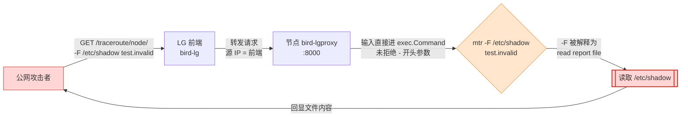
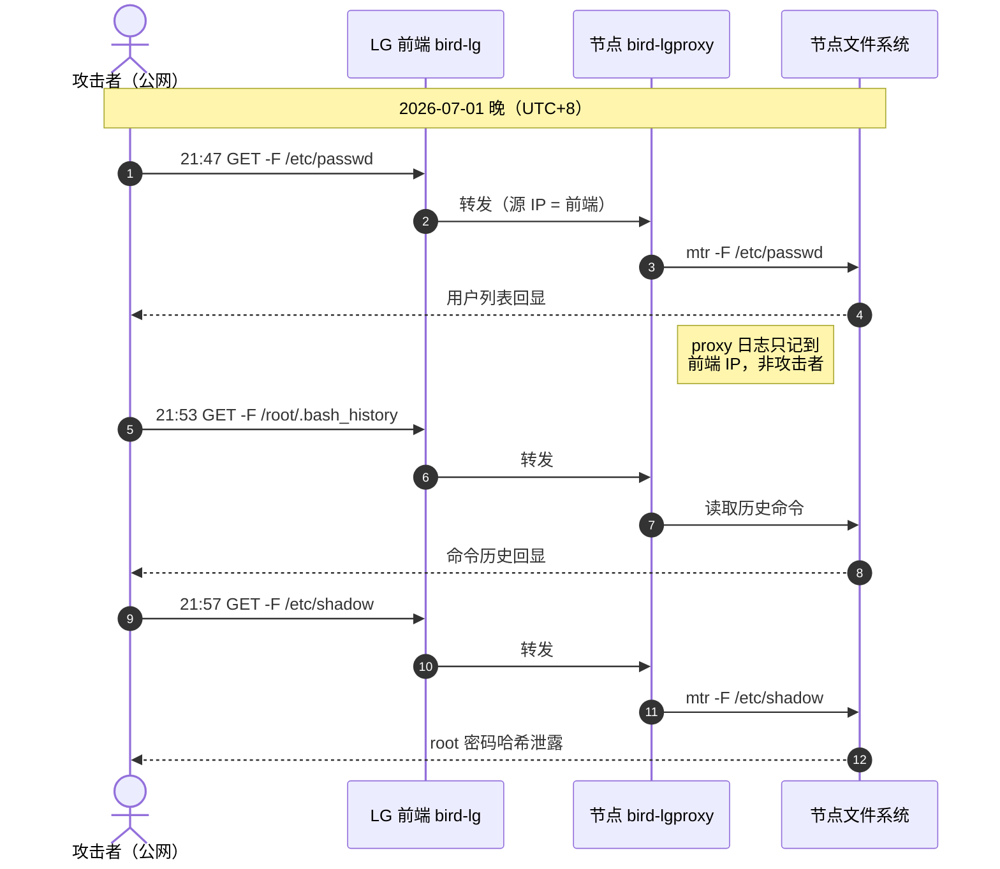
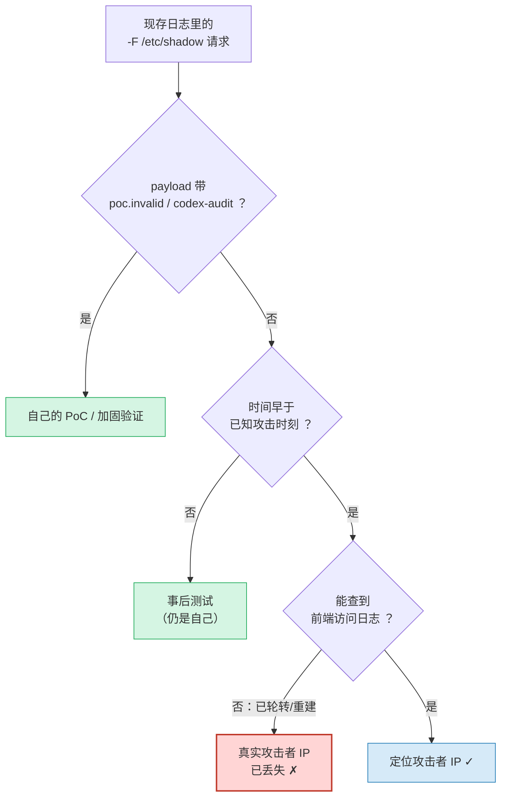

> Real hostnames, domain names, and IP addresses have been redacted in this post, while complete attack payloads and remediation commands are preserved for reproduction and self-checks.

## TL;DR

My DN42 cluster was running a publicly accessible [bird-lg-go](https://github.com/xddxdd/bird-lg-go) Looking Glass, with four nodes sharing a single frontend. Among them, `bird-lgproxy` **≤ v1.4.6** had an argument injection vulnerability (**CVE-2026-26514**, GHSA-3qm5-22pm-wqg9): an attacker injected the `-F` flag of mtr via the `q` parameter of the traceroute feature, reading arbitrary files as "report files", and ultimately read `/etc/shadow`—i.e., the root password hash—from every machine. Note that **the fix in v1.4.6 was incomplete and could be bypassed**; it was properly fixed in **v1.4.7**.

Remediation conclusion: **All four nodes were upgraded to v1.4.7, all root passwords rotated, SSH keys and scheduled tasks audited, and no backdoors or anomalous logins were confirmed.** The vulnerability was verified to be completely closed at the public network edge.

## Vulnerability Mechanics

Looking Glass's traceroute feature essentially passes the target entered by the user to the system's `mtr` / `traceroute` to run. The problem arose because older versions of `bird-lgproxy` spliced user input directly into `exec.Command`, **neither treating it as a single target nor rejecting input starting with `-`**. As a result, options could be smuggled into the user input. An attacker only needed to construct:

```
-F /etc/shadow test.invalid
```

and it would be treated as `mtr -F /etc/shadow test.invalid`. And mtr's `-F` option happens to mean "read host list from file (report file)"—mtr attempts to open `/etc/shadow` and includes the file contents in its error message; meanwhile, proxy uses `CombinedOutput()` to echo stdout + stderr back to the frontend together, leaking the file contents via standard error output. `test.invalid` was merely a placeholder to make it "look like a target".

Thus, a single HTTP GET could read arbitrary files:

```bash
# 攻击者视角：通过公网 LG 前端读取 /etc/shadow
curl 'https://<lg-frontend>/traceroute/<node>/-F%20%2Fetc%2Fshadow%20test.invalid'
```

The root cause of this type of issue is an age-old adage: **never split user input into command-line arguments**. A target should be treated as an indivisible, whole string, and anything starting with `-` must never be interpreted as an option.

The diagram below illustrates the entire injection chain—note that the red path shows how the vulnerability turned an HTTP parameter into arbitrary file read all the way through:



## Attack Timeline

From the `bird-lgproxy` logs of the affected nodes, a very "textbook" reconnaissance-to-privilege-escalation information gathering process can be observed (time is in UTC+8, the evening of July 1, 2026):

| Time (UTC+8) | Who | What Happened |
|---|---|---|
| 07-01 21:47 | Attacker (forwarded via frontend) | `bird-lgproxy` read `/etc/passwd` (enumerate users, confirm readable files) |
| 07-01 21:53 | Attacker | Read `/root/.bash_history` (dig through command history, look for clues/credentials) |
| 07-01 21:57 | Attacker | Read `/etc/shadow` (obtain root password hash) |

Looking at the actions during these ten minutes via a sequence diagram makes it even more intuitive, and also clarifies which layer logged the events along the "Attacker → Frontend → Proxy → Filesystem" chain:




The payload in the logs looked like this (before URL encoding):

```
GET /traceroute?q=-F+/etc/passwd+<占位主机>
GET /traceroute?q=-F+/etc/shadow+<占位主机>
```

The sequence from `passwd` → `bash_history` → `shadow` is typical: first confirm that the vulnerability is exploitable, then search places where credentials might be hidden, and finally go straight for the password hash in preparation for offline cracking. The entire process took only ten minutes.

## A Forensics Pitfall: The "Attacker IP" in the Logs Was My Own Frontend Machine

Here is a lesson worth highlighting separately.

bird-lg uses an architecture where the **frontend and backend proxy are decoupled**: public users access the frontend, and the frontend forwards traceroute requests to the `bird-lgproxy` on each node. Therefore, when I checked the proxy logs on the targeted nodes for the "attacker IP", the source addresses I saw were **all the frontend machine's own IP**—because to the proxy, the requests did indeed come from the frontend.

The real attacker's public IP only existed in the **access logs of the frontend (reverse proxy / frontend container)**. However, by the time I started forensics:

- The proxy container had been rebuilt during upgrades, leaving only logs from the current day;
- The reverse proxy access logs on the frontend machine had already rotated, with the earliest records dating after the attack occurred;
- The journald retention window on each node had also rolled past the time of the original attack.

The result: **All `-F /etc/shadow` requests in the surviving logs pointed back to my own subsequent PoC verification and hardening tests after tracing** (the payloads even contained markers I added myself, such as `poc.invalid` and `codex-audit`). The original attacker's real IP was lost with log rotation.

The decision logic when tracing each `-F /etc/shadow` request was roughly like this; in the end, all paths leading to the "real attacker IP" were blocked by log retention:




Fallback checks were also performed to confirm there were no anomalous consequences:

- **Login audit**: All successful root login source IPs were either my own outbound IPs or my frequently used broadband IP ranges (logins with keys used my own deployment keys); there were no successful logins from unfamiliar foreign IPs and no signs of lateral movement.
- **authorized_keys**: Verified fingerprints one by one; only my own keys were present, with no unknown keys.
- **Scheduled tasks / processes**: No backdoor cron jobs, no suspicious persistent processes.

The lesson is straightforward: **For services facing the public internet, always extend the retention period for access logs and collect them centrally**. By the time something happens and you go back to check, the logs are often already gone—especially in architectures like this where "the real source is only recorded at the frontend layer", the forensics window is much shorter than you think.

## Vulnerability Report and Acknowledgments

After discovering the anomaly, I immediately realized this was a genuine security issue, but I am not an expert in security research myself. So I shared the situation with my friend **[@KaguraiYoRoy](https://github.com/KaguraiYoRoy)**, who ultimately completed the vulnerability analysis, reproduction, and standardized security report, and we responsibly disclosed it together to the upstream author. Based on this, upstream published an official security advisory and patch:

> **GHSA-3qm5-22pm-wqg9** — Argument Injection / Exposure of Sensitive Information
> CVE-2026-26514 · CWE-88 (Argument Injection) + CWE-200 (Sensitive Info Exposure)
> CVSS 3.1: **7.5 High** (`AV:N/AC:L/PR:N/UI:N/S:U/C:H/I:N/A:N`)
> Affected versions: `bird-lgproxy` ≤ 1.4.6 · Patched version: 1.4.7 · Published: 2026-07-02
> Acknowledgments: **KaguraiYoRoy** (Analyst), **AndyYJF** (Reporter)
>
> Advisory URL: <https://github.com/xddxdd/bird-lg-go/security/advisories/GHSA-3qm5-22pm-wqg9>

Taking this incident as an example, I'd also like to say: **Not knowing security is nothing to be ashamed of, but don't bottle it up when you find an issue.** Finding a knowledgeable friend to go through the responsible disclosure process together is far better than blindly fumbling around or pretending not to see it.

## Fix: Upgrading to v1.4.7

It is worth emphasizing: **The initial fix in v1.4.6 was not thorough**—it could be bypassed by spaceless variants, such as `-F/etc/shadow` (where the flag and the path are joined together, bypassing the whitespace-based check at the time). The real fix came in **v1.4.7**: it added a `strings.HasPrefix(query, "-")` check for traceroute targets, **directly rejecting any input starting with `-`**, cutting off the possibility of "treating input as options" at the root. In this way, `-F /etc/shadow` is directly blocked and returns `Invalid target.`, completely shutting down the CVE.

I upgraded all four nodes to v1.4.7. There are two deployment methods in the cluster, handled differently:

**Nodes running binaries directly via systemd**—replace binary + restart:

```bash
cd /tmp
curl -sLO https://github.com/xddxdd/bird-lg-go/releases/download/v1.4.7/bird-lgproxy-go-v1.4.7-linux-amd64.tar.gz
tar xzf bird-lgproxy-go-v1.4.7-linux-amd64.tar.gz
cp -a /usr/local/bin/bird-lgproxy-go /usr/local/bin/bird-lgproxy-go.pre-v1.4.7.bak  # 留回滚点
cp -f bird-lgproxy-go /usr/local/bin/bird-lgproxy-go
chmod +x /usr/local/bin/bird-lgproxy-go
systemctl restart bird-lgproxy
```

**Nodes deployed via Docker**—using a local image based on `FROM scratch`, replace the proxy binary inside and rebuild:

```bash
# 构建上下文里就一个 Dockerfile + proxy 二进制 + 自带的 traceroute
# Dockerfile:
#   FROM scratch
#   COPY proxy /proxy
#   COPY traceroute /traceroute
#   ENTRYPOINT ["/proxy"]
cp -f proxy.v147 ./bird-lgproxy-v1.4.7/proxy
docker compose up -d --build bird-lgproxy
```

## Verification: Testing Against Ourselves with the Attacker's Original Payload

Verification shouldn't just rely on the version number; it must be verified using the **attacker's actual path**. I replayed the original payload through the public frontend against each node:

```bash
for node in <node1> <node2> <node3> <node4>; do
  curl -s "https://<lg-frontend>/traceroute/$node/-F%20%2Fetc%2Fshadow%20test.invalid" \
    | grep -c 'root:'   # 期望：0
done
```

All four returned `Invalid target.`, with zero leakage of `/etc/shadow` contents. Testing directly against local `:8000` yielded the same result:

```bash
curl -s 'http://127.0.0.1:8000/traceroute?q=-F+/etc/shadow+8.8.8.8'
# 旧版：吐出 /etc/shadow 内容
# v1.4.7：HTTP 400 / Invalid target.
```

## Wrap-Up Checklist

- [x] All four nodes upgraded to v1.4.7, rollback binaries/compose retained
- [x] Verified by replaying original payload via public frontend, zero `/etc/shadow` leakage across all four nodes
- [x] Rotated all root passwords (≥16 mixed characters)
- [x] Audited `authorized_keys` fingerprints, cron, persistent processes—no anomalies
- [x] Checked login history—no successful logins from unfamiliar IPs

## A Few Reflections

1. **Never split user input into command-line arguments.** This is not a pitfall unique to Looking Glass; anywhere external input is concatenated into `exec`, beware of injections starting with `-`. Treating targets as an indivisible string is the baseline.
2. **Don't leave proxies for public services running bare on `0.0.0.0`.** This time, `bird-lgproxy :8000` on all four of my nodes was directly reachable from the public internet—the next step is to restrict it so only the frontend can access it (iptables / listening only on the internal network). One less public entry point means one less attack surface.
3. **Configure log retention in advance and collect logs centrally.** Only after the incident did I realize the real attacker IP was only recorded at the frontend layer and had already been lost to rotation. The golden window for forensics is much shorter than imagined.

---

*This article is for documentation and sharing purposes; all real hostnames, domain names, and IPs have been redacted. If you are also running a public Looking Glass, it is recommended to verify immediately that your `bird-lgproxy` version is ≥ v1.4.7.*

