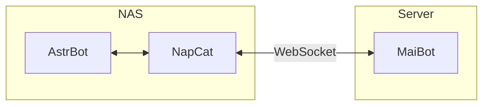

# Inspiration #
Recently, I have been tinkering with QQ bots. Currently, the most prominent backend projects are [AstrBot](https://astrbot.app/) and [MaiBot](https://docs.mai-mai.org/). AstrBot emphasizes functionality (offering diverse plugin services), while MaiBot focuses on LLM chat and anthropomorphic behavior. Consequently, I wanted to connect my bot to both projects simultaneously. However, due to Tencent's risk controls, NapCat deployed on a cloud server is prone to account bans; meanwhile, due to network environment constraints, MaiBot is best run on an overseas server (allowing easy access to APIs of AIs like Gemini). Therefore, I came up with the idea of deploying AstrBot and NapCat on a home NAS while deploying MaiBot on a public cloud server. The topology diagram is as follows:



:::alert{type="info"}
这里将NapCat和AstrBot部署在同一个服务器上，这是因为AstrBot在执行一些功能的时候需要和NapCat共用文件夹，若分开部署则会出现很多问题
:::


# Deployment #
## Prerequisites ##
 - [x] A public cloud server (preferably 2C2G or higher)
 - [x] A Linux server on residential broadband
 - [x] Docker environment
## Begin Deployment ##
- First, SSH into your home cloud/NAS:
```bash
mkdir astrbot
cd astrbot
wget https://raw.githubusercontent.com/NapNeko/NapCat-Docker/main/compose/astrbot.yml
sudo docker compose -f astrbot.yml up -d
```
Done.
- Next, access the public cloud server:


:::alert{type="info"}
该部分以下内容大多直接来自官方文档
:::

## 1. Preparing the MaiBot Deployment Environment

### 1.1 Create Project Directory

```bash
mkdir -p maim-bot/docker-config/{mmc,adapters} && cd maim-bot
```

### 1.2 Download Docker Compose File

```bash
wget https://raw.githubusercontent.com/Mai-with-u/MaiBot/main/docker-compose.yml
```

> Alternative download method  
> If the direct GitHub connection is unstable, you can use a mirror source:
>
> ```bash
> wget https://fastly.jsdelivr.net/gh/Mai-with-u/MaiBot@main/docker-compose.yml
> ```

### 1.3 Delete the NapCat Container and Uncomment the Port Mapping for `adapter`
Edit using `vim docker-compose.yml`. Once edited, it should look as follows:
```toml
services:
  adapters:
    container_name: maim-bot-adapters
    #### prod ####
    image: unclas/maimbot-adapter:latest
    # image: infinitycat/maimbot-adapter:latest
    #### dev ####
    # image: unclas/maimbot-adapter:dev
    # image: infinitycat/maimbot-adapter:dev
    environment:
      - TZ=Asia/Shanghai
    ports: #<--此处修改
      - "8095:8095" #<--此处修改
    volumes:
      - ./docker-config/adapters/config.toml:/adapters/config.toml # 持久化adapters配置文件
      - ./data/adapters:/adapters/data # adapters 数据持久化
    restart: always
    networks:
      - maim_bot
  core:
    container_name: maim-bot-core
    #### prod ####
    image: sengokucola/maibot:dev
    # image: infinitycat/maibot:latest
    #### dev ####
    # image: sengokucola/maibot:dev
    # image: infinitycat/maibot:dev
    environment:
      - TZ=Asia/Shanghai
      - EULA_AGREE=99f08e0cab0190de853cb6af7d64d4de # 同意EULA
      - PRIVACY_AGREE=9943b855e72199d0f5016ea39052f1b6 # 同意EULA
#    ports:
#      - "8000:8000"
    volumes:
      - ./docker-config/mmc/.env:/MaiMBot/.env # 持久化env配置文件
      - ./docker-config/mmc:/MaiMBot/config # 持久化bot配置文件
      - ./data/MaiMBot/maibot_statistics.html:/MaiMBot/maibot_statistics.html #统计数据输出
      - ./data/MaiMBot:/MaiMBot/data # 共享目录
      - ./data/MaiMBot/plugins:/MaiMBot/plugins # 插件目录
      - ./data/MaiMBot/logs:/MaiMBot/logs # 日志目录
      - site-packages:/usr/local/lib/python3.13/site-packages # 持久化Python包
    restart: always
    networks:
      - maim_bot
  sqlite-web:
    # 注意：coleifer/sqlite-web 镜像不支持arm64
    image: coleifer/sqlite-web
    container_name: sqlite-web
    restart: always
    ports:
      - "8120:8080"
    volumes:
      - ./data/MaiMBot:/data/MaiMBot
    environment:
      - SQLITE_DATABASE=MaiMBot/MaiBot.db  # 你的数据库文件
    networks:
      - maim_bot

  # chat2db占用相对较高但是功能强大
  # 内存占用约600m，内存充足推荐选此
  # chat2db:
  #   image: chat2db/chat2db:latest
  #   container_name: maim-bot-chat2db
  #   restart: always
  #   ports:
  #     - "10824:10824"
  #   volumes:
  #     - ./data/MaiMBot:/data/MaiMBot
  #   networks:
  #     - maim_bot

volumes:
  site-packages:
networks:
  maim_bot:
    driver: bridge

```
## 2. MaiBot Environment Configuration

### 2.1 Prepare Configuration File Templates

```bash
# 获取核心组件配置模板
wget https://raw.githubusercontent.com/MaiM-with-u/MaiBot/main/template/template.env      -O docker-config/mmc/.env
# 若 GitHub 直连不稳定，可使用镜像源：https://fastly.jsdelivr.net/gh/Mai-with-u/MaiBot@main/template/template.env
```

Fetch `adapter`'s `config.toml`:

```bash
wget https://github.com/MaiM-with-u/MaiBot-Napcat-Adapter/raw/refs/heads/main/template/template_config.toml      -O docker-config/adapters/config.toml
# 若 GitHub 直连不稳定，可使用镜像源：https://fastly.jsdelivr.net/gh/Mai-with-u/MaiBot-Napcat-Adapter@main/template/template_config.toml
```

> If service names in the configuration file are unavailable, you can replace them with container names  
> * The `MaiBot_Server` setting can be replaced with `maim-bot-core`  
> * The `napcat` WS client can be replaced with `ws://maim-bot-adapters:8095`

### 2.2 Pre-create File

This file is for MaiBot's runtime statistics report.

`MacOS/Linux`:

```bash
mkdir -p data/MaiMBot && touch ./data/MaiMBot/maibot_statistics.html
```

`Windows`:

```bash
mkdir data\MaiMBot && type nul > .\data\MaiMBot\maibot_statistics.html
```

### 2.3 Modify Related Configurations

```bash
vim docker-config/mmc/.env
```

The following key parameters need to be modified:

```ini
# 网络监听配置
HOST=0.0.0.0
```

Modify adapter configuration file:

```bash
vim docker-config/adapters/config.toml
```

```toml
[napcat_server] # Napcat连接的ws服务设置
host = "0.0.0.0"
port = 8095
heartbeat_interval = 30
tocken = '123123123' #这里必须要设置，为了NAS和公网服务器建立websocket连接时鉴权

[maibot_server] # 连接麦麦的ws服务设置
host = "core"
port = 8000
```

### 2.3 Uncomment EULA in docker-compose.yml

```bash
vim docker-compose.yml
# 取消注释以下两行（30-31 行）
- EULA_AGREE=bda99dca873f5d8044e9987eac417e01  # 同意 EULA
- PRIVACY_AGREE=42dddb3cbe2b784b45a2781407b298a1 # 同意 Privacy
```

### 2.4 Database Management Tool

```yaml
#sqlite-web:
#  # 注意：coleifer/sqlite-web 镜像不支持 arm64
#  image: coleifer/sqlite-web
#  container_name: sqlite-web
#  restart: always
#  ports:
#    - "8120:8080"
#  volumes:
#    - ./data/MaiMBot:/data/MaiMBot
#  environment:
#    - SQLITE_DATABASE=MaiMBot/MaiBot.db
#  networks:
#    - maim_bot

# chat2db 占用相对较高但是功能强大
# 内存占用约 600m，内存充足推荐选此
chat2db:
  image: chat2db/chat2db:latest
  container_name: maim-bot-chat2db
  restart: always
  ports:
    - "10824:10824"
  volumes:
    - ./data/MaiMBot:/data/MaiMBot
  networks:
    - maim_bot
```

### 2.5 Directory Structure

```
.
├── docker-compose.yml
├── data
│   └── MaiMBot
│       └── maibot_statistics.html
└── docker-config
    ├── adapters
    │   └── config.toml
    └── mmc
        └── .env
```

---

## 3. Initialize Container Environment

### 3.1 Start Containers for the First Time to Generate Remaining Configuration Files

```bash
docker compose up -d && sleep 15 && docker compose down
```

### 3.2 Adjust MaiBot Configuration

```bash
vim docker-config/mmc/bot_config.toml
vim docker-config/mmc/model_config.toml
```

---

## 4. Start MaiBot

### 4.1 Start All Components

```bash
docker compose up -d
```

### 4.2 Verify Service Status

```bash
docker compose ps
```

---

## Configure NapCat
NapCat configuration portal: http://公网服务器IP:6099  
- For network configuration, use a WebSocket client with the URL ws://<你的公网服务器ip>:8095, set token identical to the token you previously configured in adapter, and enable it:
 
All done!

---
# References:

1. [Deploy AstrBot Using Docker](https://docs.astrbot.app/deploy/astrbot/docker.html)

2. [Deploy MaiBot Using Docker](https://docs.mai-mai.org/manual/deployment/mmc_deploy_docker.html)


