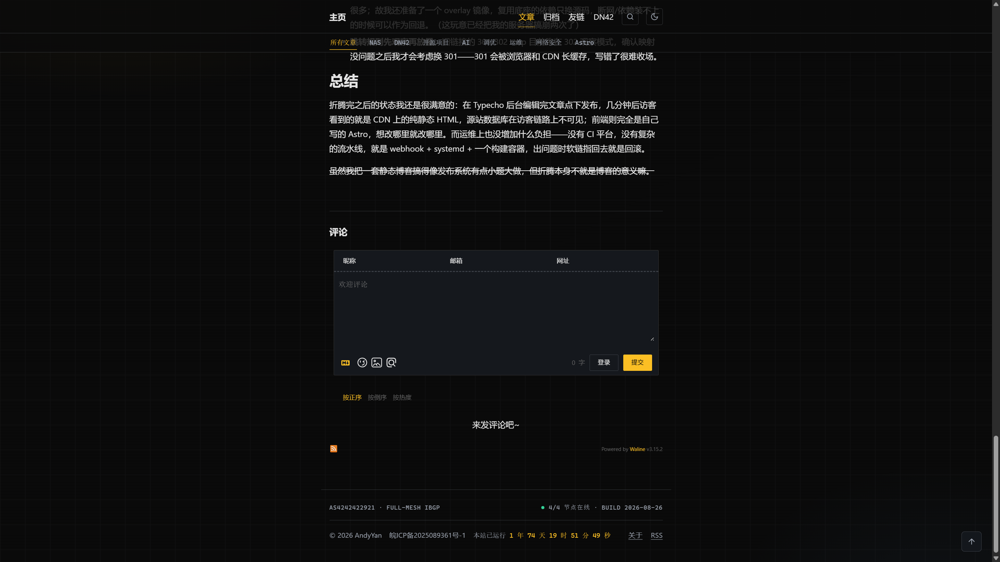
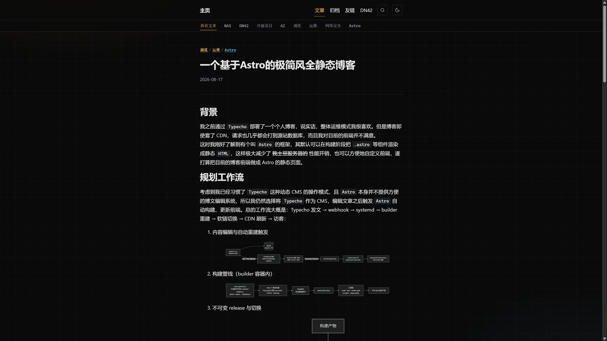
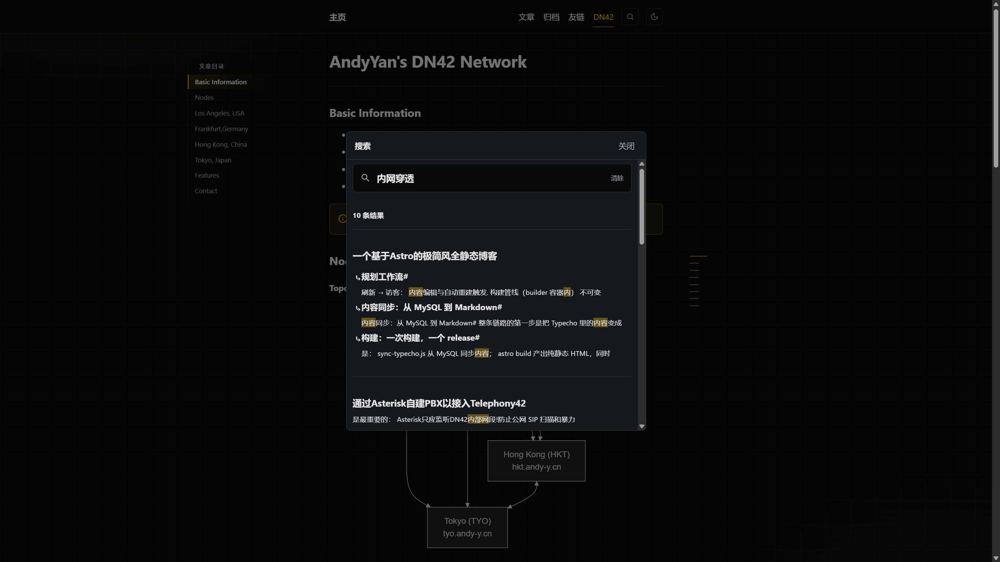
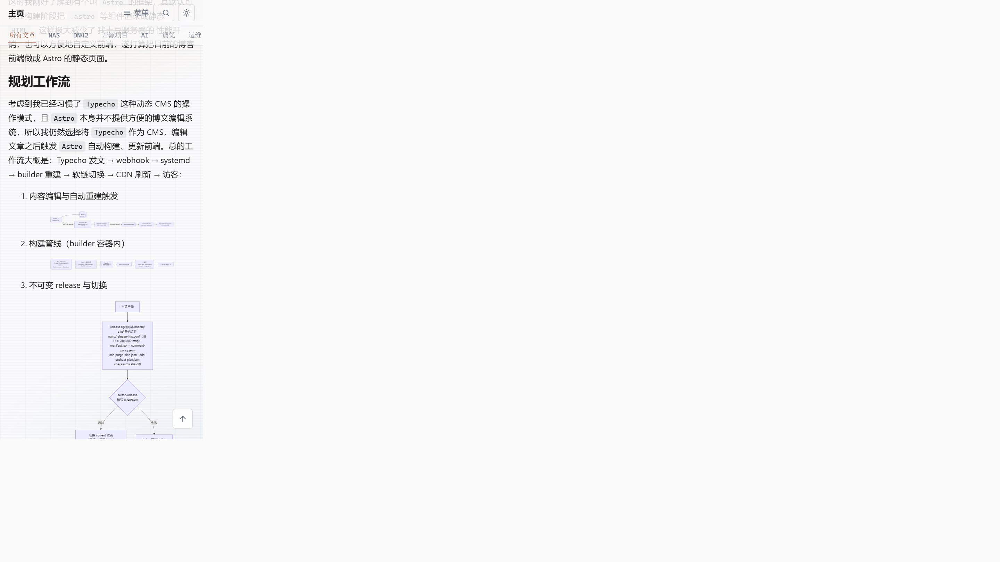
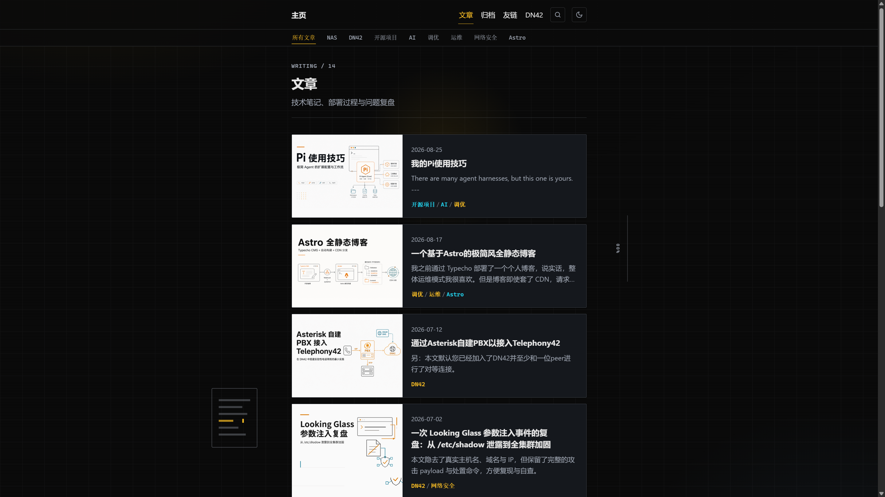

# 前端发现明细

> 配套 [`README.md`](./README.md)。级别按「访客立刻感知 × 修起来的成本」定级,不是安全严重度。
> 截图在 [`assets/`](./assets)。行号以 2026-08-26 仓库为准。

---

## P0(2)

### F-01 · 顶栏毛玻璃失效:滚动时正文文字与导航重叠

- **现象**:滚动文章时,正文从 82% 透明的 sticky 顶栏后面直接透出来,和导航文字叠在一起。桌面、移动端都能复现。
- **位置**:源码 `astro/src/styles/global.css:266-273`(`.site-header`);线上压缩 CSS `/_astro/BaseLayout.*.css`
- **根因(已实锤)**:源码同时写了标准 `backdrop-filter: blur(12px)` 和 `-webkit-backdrop-filter: blur(12px)`。线上压缩产物只剩 `-webkit-` 前缀版本,标准属性被构建环节丢掉。实测 Chromium 144:
  - `CSS.supports('backdrop-filter', 'blur(12px)')` → **true**
  - `CSS.supports('-webkit-backdrop-filter', 'blur(12px)')` → **false**
  - `getComputedStyle(.site-header).backdrop-filter` → `none`
  - 顶栏背景实际是 `color-mix(in srgb, var(--bg) 82%, transparent)`,没有模糊,只有半透明。
- **修法**:检查 CSS 压缩器的浏览器目标(browserslist / lightningcss targets),确保标准属性保留;或删掉前缀那行只留标准写法。兜底:把 `.site-header` 底色改为不透明 `var(--bg)`。
- **工作量**:约 10 分钟 + 一次构建验证。

### F-02 · 部分文章正文全是 h1:目录、进度条、语义一起失效

- **现象**:`/posts/astro/` 里「背景」「规划工作流」等章节标题全部是 h1(一页十几个 h1)。这篇因此没有左侧目录、没有右侧章节进度条。对比 `/posts/looking-glass-shadow-incident/` 用 h2 写章节,两者都有。
- **位置**:Markdown 源标题层级;渲染管线 `astro/astro.config.mjs` 无降级插件;`astro/src/scripts/reading-progress.ts:31-32` 只收集 `h2[id]`,不足 2 个直接 `return NOOP`
- **根因**:Typecho 同步过来的 Markdown 用了 `#` 一级标题,rehype 原样输出。`initReadingProgress` 硬编码 h2,所以标题层级一错,目录整套失效。多个 h1 对 SEO 与读屏也是明确减分。
- **修法**:在 `sync-typecho.js` 或加一个 rehype 插件,把正文标题整体降一级(h1→h2、h2→h3……),保证每页只有文章标题一个 h1。修完后目录/进度条自动全站生效,无需改 `reading-progress.ts`。
- **工作量**:1~2 小时 + 重建。建议抽查现有 14 篇,确认哪些用了 `#`、哪些已经是 `##`。

---

## P1(2)

### F-03 · Pagefind 中文搜索按单字匹配,相关性差

- **现象**:搜索「内网穿透」返回 10 条结果,高亮命中的是「内容」中的「内」「容」——CJK 查询被拆成单字,排在前面的结果和查询意图无关。
- **位置**:`astro/src/components/SearchDialog.astro`;构建 `pagefind --site dist`;页面已设 `lang="zh-CN"`
- **修法**:
  - 短期:检查 Pagefind 索引产物是否启用了 zh 分词(显式 `--force-language zh` 或等价配置),实测对比。
  - 长期:14 篇文章体量很小,构建期生成一份带标题/标签加权的自建索引(minisearch + 中文分词,或 fuse.js)会明显好于通用方案。
- **工作量**:先实验半天。

### F-04 · 移动端 mermaid 流程图缩成不可读的横条

- **现象**:手机宽度下横向流程图整体缩放到列宽,节点文字只有几个像素,没有点击放大、也没有横向滚动。这个博客图表密度高,对移动端读者伤害最大。
- **位置**:BEOE 产物图;lightbox 已存在于 `astro/src/scripts/lightbox.ts`,由 `article.ts` 挂到文章容器,但未覆盖 mermaid 图(或缩放策略把图压死)。
- **修法**:把 lightbox 覆盖到 mermaid 产物图,点击全屏可缩放;或给图表容器设 `min-width` + 横向滚动。前者体验更好。
- **工作量**:1~2 小时。

---

## P2(6)

### F-05 · 页脚「4/4 节点在线」是写死的字符串

- **位置**:`astro/src/layouts/BaseLayout.astro:221-223`
- **问题**:`● 4/4 节点在线 · BUILD {buildDate}` 是静态文本,视觉上像实时监控。节点挂了页脚仍报 4/4,反而伤可信度。首页拓扑卡文案是「FULL-MESH / 4 节点」,两边叙事也不统一。
- **修法**:构建时从 FlapAlerted / Looking Glass 拉一次真实状态写进页面;或把措辞改成不含「在线」的静态事实(「4 节点 · full-mesh iBGP」)。

### F-06 · 若干小毛病(一次顺手清掉)

| 问题 | 位置 | 动作 |
|---|---|---|
| 标题锚点 `aria-label` 全是「本节锚点」,读屏用户听到一串同名链接 | `astro/astro.config.mjs:105` `rehype-autolink-headings` | 去掉静态 `ariaLabel`,让锚点继承标题文本 |
| 代码块按钮是英文「Copy to clipboard」 | `astro-expressive-code` 配置 | locale 或覆写文案为「复制」 |
| `/archives/` 会 404(真实路径 `/archive/`),单复数易踩坑 | 部署层 / nginx | 加一条 301 |
| 文章页顶部一直挂着分类条,滚动时与顶栏一起占竖向空间 | `BaseLayout.astro:196` `catBarVisible` | 详情页隐藏分类条,或下滑收起 |

### F-07 · 封面图在暗色主题下是刺眼白块

- **现象**:AI 生成封面全是白底,暗色列表页里整页最亮的元素是装饰图。
- **对照**:同日上午视觉走查已记过一次,见 [`../2026-08-26/visual-review.md`](../2026-08-26/visual-review.md) 第 1 条。本次复测仍然存在。
- **修法**:低成本——暗色下 `filter: brightness(.85)` + 封面区右侧分隔线,垫底改 `var(--surface)`。彻底——生成 prompt 产暗底变体,`picture` 按主题切换。

---

## 阅读体验(不是 bug,是缺口)

文章页现在「读完即断」——正文结束直接掉进评论区。内链闭环是整站最明显的产品缺口。

| 建议 | 说明 |
|---|---|
| 文末 prev/next + 相关文章 | 构建期按时间排相邻篇,相关按共享标签选 2~3 篇。纯静态就能做 |
| 阅读时长 + 更新日期 | 布局已支持 `updatedDate`(会输出 `article:modified_time`),页面上没显示。中文按 300~400 字/分钟估算即可 |
| 移动端目录入口 | 修好 F-02 后桌面目录会恢复;手机仍没有任何章节导航。长文加浮动「目录」按钮,视觉跟 to-top 一套 |

---

## 革新方向

### 首页拓扑卡升级成真仪表盘

这是全站最有个人特色的组件,目前是纯装饰动画(节点漂移 + 数据包巡航)。已有 Looking Glass(`lg.andy-y.cn`)和 FlapAlerted(`flap.andy-y.cn`)——构建期或客户端只读拉取注入真实节点状态、延迟、last-flap,让「PERSONAL LEDGER」从美学变成真遥测。配合 F-05,整站「NOC 面板」叙事就闭环了。别的博客抄不走。

证据:[`assets/home-dark-hero.png`](./assets/home-dark-hero.png)、[`assets/home-light-hero.png`](./assets/home-light-hero.png)

### DN42 系列做成专题路线图

相关已有多篇(Asterisk PBX、LG 事件复盘、Grafana 监控……)散在时间线里。做一个 series 页按「入门 → 组网 → 监控 → 安全」串路径,配拓扑图当封面,容易被同好收藏和外链。

### 构建期生成带标题的分享卡

文章 `og:image` 现在用白底封面,转发信息量偏低。builder 容器已在,用 satori/resvg 生成「站点风格底 + 标题 + 标签」的分享卡,边际成本低。

### 评论:Waline 与 giscus

文章里提过想接 giscus。giscus 免运维、抗 spam,但要求 GitHub 账号,且 github.com 在大陆连通性不稳——对国内技术访客可能提高门槛。建议 Waline 为主,先配好反 spam 和邮件通知;giscus 若上,作并列而不是替换。

---

## 代码层:性能与维护性

来自对 `astro/` 的完整梳理,访客不一定直接感知。

| 事项 | 现状 | 建议 |
|---|---|---|
| 首页拓扑卡 rAF 常驻 | `index.astro` 里 `requestAnimationFrame` 只要卡片在页面就一直跑(标签页隐藏、卡片滚出视口也不停) | `IntersectionObserver` + `visibilitychange` 暂停 |
| 封面图无响应式尺寸 | 封面走 `tc.andy-y.cn` 原图 + `probe-image-size` 宽高,移动端也加载全尺寸;未用 `astro:assets` | 图床若支持缩放参数则生成 srcset;或迁 assets |
| KaTeX `font-display: block` | 数学页字体加载期间公式空白 | 改 `swap` 或 `optional` |
| ClientRouter 未配 prefetch | 列表→文章跳转不预取 | `defaultStrategy: 'hover'` |
| `global.css` 单体 ~2800 行 | tokens、排版、页面装饰全在一个文件 | 按 tokens / prose / chrome 拆分 |
| 杂项债务 | 包名仍是 `andy-blog-astro-spike`;`about.md` 正文被 `AboutProfile` 替代成死代码;`friends.md` 与 `friends.astro` 双源;分类色映射 `category-tone.ts` 需手工维护 | 一次清理 |

分页 URL 分裂(`/posts/` vs `/page/n/`)是 Typecho 遗留兼容,改的话必须带 301,不急。

---

## 动手顺序

| 顺序 | 事项 | 预估 |
|---|---|---|
| 1 | 恢复标准 `backdrop-filter`(或顶栏改不透明) | 10 分钟 |
| 2 | 正文标题降级 h1→h2(sync 或 rehype)+ 重建 | 1~2 小时 |
| 3 | 锚点 aria-label / 复制按钮文案 / archives 重定向 | 30 分钟 |
| 4 | mermaid 接入 lightbox | 1~2 小时 |
| 5 | 文末 prev/next + 相关文章 | 半天 |
| 6 | 封面暗色适配 + 阅读时长/更新日期 | 半天 |
| 7 | 搜索中文分词方案验证 | 半天(先实验) |
| 8 | 拓扑卡真实状态 / 专题页 / OG 卡 | 各 1 天,按兴趣 |
| 9 | 维护性清理(rAF 暂停、prefetch、CSS 拆分、包名/死代码) | 零散时间 |

---

## 走查覆盖

| 页面 | URL | 截图 |
|---|---|---|
| 首页暗色 | `/` | `home-dark-hero.png` |
| 首页亮色 | `/` | `home-light-hero.png` |
| 首页移动 | `/` @ 390px | `home-mobile.png` |
| 文章列表 | `/posts/` | `posts-list-dark-covers.png` |
| 文章(h1 问题) | `/posts/astro/` | `post-astro-h1-headings.png` |
| 文章(h2 正常) | `/posts/looking-glass-shadow-incident/` | — |
| 归档 | `/archive/` | `archive-page.png` |
| 友链 | `/friends/` | — |
| DN42 | `/dn42/` | `dn42-page.png` |
| 关于 | `/about/` | — |
| 404 | `/archives/`(误路径) | — |
| 搜索 | DN42 页打开弹窗,查询「内网穿透」 | `search-cjk-unigrams.png` |
| 移动 mermaid | `/posts/astro/` @ 390px | `mobile-mermaid-unreadable.png` |
| 顶栏穿透 | 文章页滚到底 | `header-text-bleed.png` |

环境:Chromium 144 · Windows · 桌面视口 + `390×844` 模拟 · 亮/暗主题均过。
