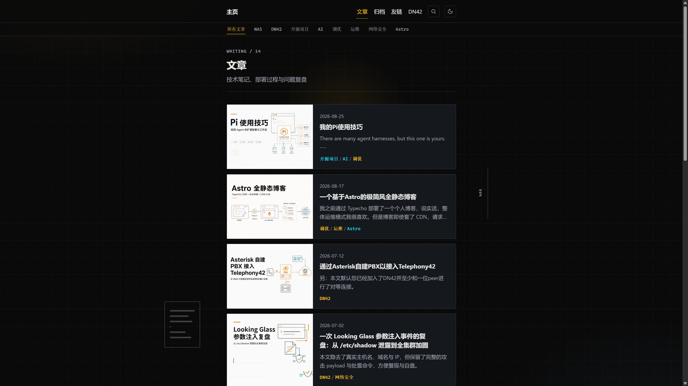
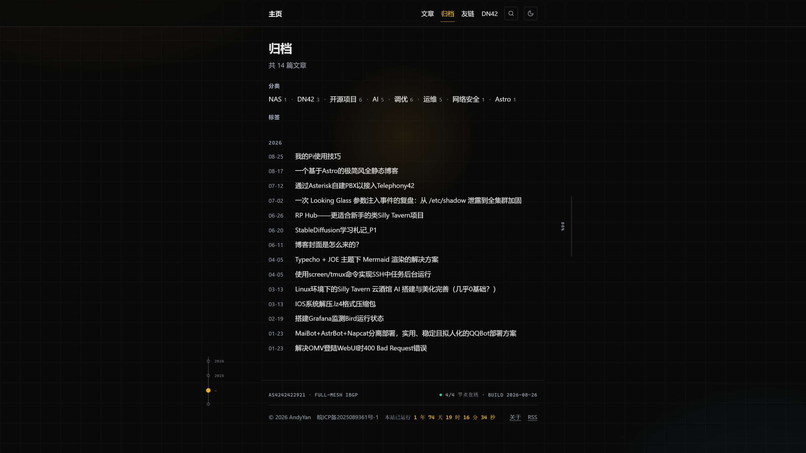
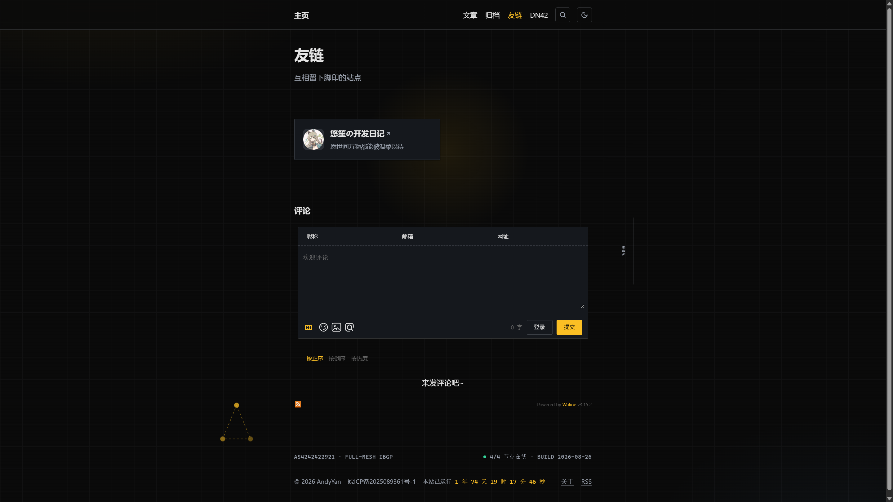
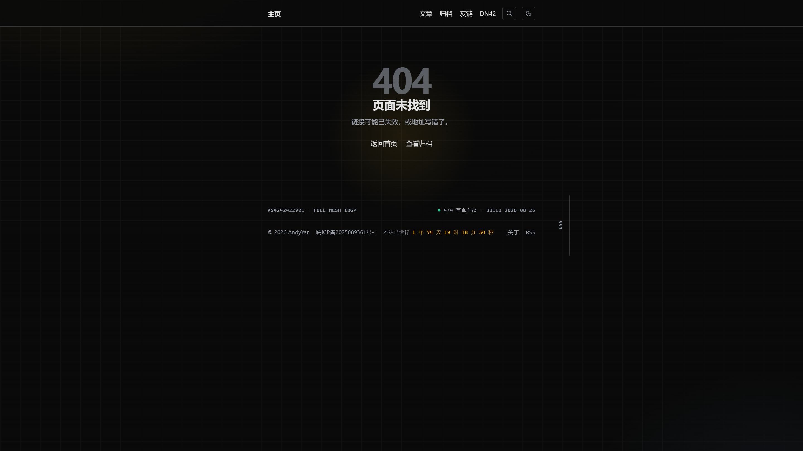
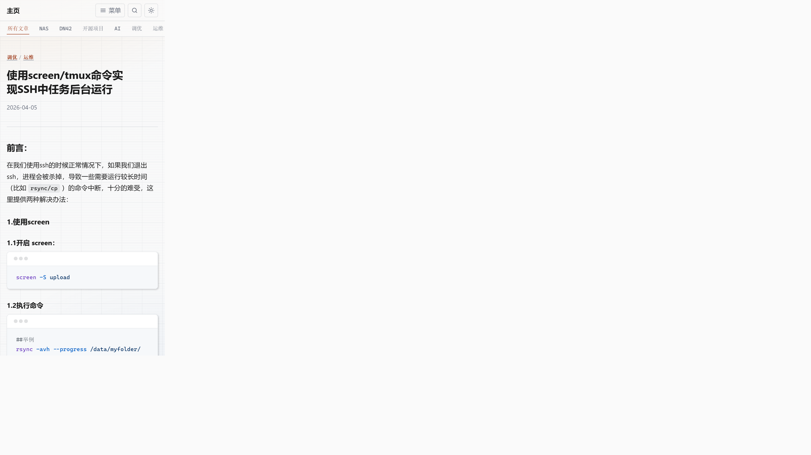

# 前端视觉走查与美化建议

> 配套 [`README.md`](./README.md)。实地走查了 www.andy-y.cn 的双主题与移动端全部页面,截图存于 [`assets/`](./assets)。
> 改法中的 CSS 变量名(`--surface`/`--border` 等)以项目 `astro/src/styles/global.css` 实际定义为准,落地时请核对。

## 总体印象

设计完成度高,是一套自洽的 **"NOC / 网络台账"** 主题:等宽字标签(`WRITING / 14`、`AS424242921 · FULL-MESH IBGP`)、蓝图网格背景、右侧竖排章节索引脊、暖琥珀点缀色、页脚实时运行时长与 BGP 状态。双主题(明/暗)、View Transitions 软导航、`prefers-reduced-motion` 兜底都到位。下列为可落地的打磨点,分"该修的硬伤"与"锦上添花"。

---

## 该修的硬伤

### 1. 文章封面在暗色主题下是刺眼白块


文章列表卡片左侧封面用 `object-fit: contain` + 强制 `#fff` 垫底。深色示意图(白底)本身没问题,但在近黑的页面上,每张卡片左侧都是一整块纯白,视觉割裂、亮度突兀。

- **定位**:`astro/src/styles/global.css:641-652`(`.card-cover img`)
- **改法**:垫底色跟随主题,暗色下轻微降亮 + 给封面区右侧一道分隔线柔化边界。

```css
.card-cover img {
  background-color: var(--surface);   /* 原为 #fff */
}
.card-cover {
  border-right: 1px solid var(--border);
}
html[data-theme="dark"] .card-cover img {
  filter: brightness(0.9) contrast(1.02);
}
```

### 2. 归档页"标签"空区块仍无条件渲染


"分类"有内容正常渲染,但"标签"标题在没有任何标签时依然输出一个空标题 + 空 `<ul>`,页面上留下一个孤零零的"标签"字样和一段空白。

- **定位**:`astro/src/pages/archive.astro:51-61`
- **改法**:整块用 `tags.length > 0` 包裹。

```astro
{tags.length > 0 && (
  <div>
    <h2>标签</h2>
    <ul class="taxonomy-index">
      {tags.map(({ mid, meta }) => (
        <li>
          <a href={meta.canonicalPath}>{label(meta)}</a>
          <span class="count">{countFor(mid, "tag")}</span>
        </li>
      ))}
    </ul>
  </div>
)}
```

### 3. 友链仅一条时占半宽、右侧大片空


友链列表当前是固定两列(或固定宽度),只有一个友链时卡片停在左半,右侧大片空白,显得未完成。

- **定位**:`astro/src/styles/global.css:2220-2233`(`.friends-list` / `.friend-card`)
- **改法**:改自适应网格,卡片按内容宽度铺排。

```css
.friends-list {
  display: grid;
  grid-template-columns: repeat(auto-fill, minmax(16rem, 1fr));
  gap: 1rem;
}
.friend-card {
  width: auto;
  max-width: none;
}
```

### 4. 404 内容太短时页脚吊在视口中部


404 页面内容很短,页脚(BGP 状态行 + 版权 + 运行时长)浮在视口中部,下方一大片空。同样问题会出现在任何短内容页。

- **定位**:全局布局,`astro/src/layouts/BaseLayout.astro` + `global.css`
- **改法**:flexbox 粘性页脚,把页脚压到视口底部。

```css
body {
  min-height: 100dvh;
  display: flex;
  flex-direction: column;
}
main {
  flex: 1 0 auto;
}
.site-footer {
  flex-shrink: 0;
}
```

### 5. 移动端分类子导航被截断且无"可横滑"暗示


窄屏下分类条(`所有文章 / NAS / DN42 / 开源项目 / AI / 调优 / 运维 …`)在"运维"后被视口切断,后面还有"网络安全 / Astro"但看不到,也没有任何可继续横滑的视觉提示。

- **定位**:`astro/src/styles/global.css` 的 `.cat-bar`(横向滚动容器)
- **改法**:右缘加一层渐隐遮罩暗示"还有更多",可横滑。

```css
.cat-bar {
  position: relative;
}
.cat-bar::after {
  content: "";
  position: absolute;
  inset: 0 0 0 auto;
  width: 2rem;
  background: linear-gradient(to right, transparent, var(--bg));
  pointer-events: none;
}
```

---

## 锦上添花

- **正文标题层级**:`h2`/`h3`/`h4` 字号阶差偏小,长文里层级不易一眼分辨。可给 `h2` 加一道琥珀左标(呼应主题色)并拉开字重/上下间距,强化骨架感。
- **Mermaid 图偏小**:部分流程图在正文中渲染尺寸偏小、文字吃力。可给 `.mermaid` 容器设更大 `max-width` 或允许点击放大(lightbox)。
- **阅读进度指示偏隐晦**:顶部细进度条 + 右侧章节索引脊都很克制,新访客可能注意不到章节脊的定位作用。可在首次滚动时给章节脊一个短暂高亮引导。
- **首页联系/结尾区略空**:首页信息密度高,但结尾联系区较稀疏。可补一行社交/RSS/DN42 peer 入口,让页尾更完整。

---

## 附:CDN 一致性观察

走查期间发现首页页脚显示 `BUILD 2026-08-25`,而归档、友链、404 等页面为 `BUILD 2026-08-26`。用 `fetch(..., {cache:'no-store'})` 回源核对确认是 **CDN 边缘缓存了旧首页**,并非构建产物不一致。建议发布后对首页(及 `/`、`/index.html`)做一次精确刷新,或核对首页在 CDN 的缓存键与刷新清单是否覆盖到位。
